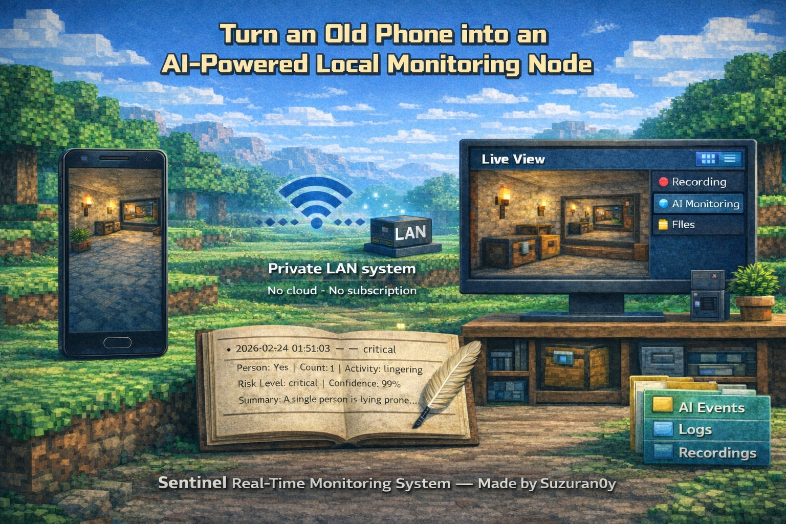

<a id="top"></a>

# Sentinel Real-Time Monitoring System

[](#stars)
[](#stars)
[](https://github.com/suzuran0y/CCTV-Smartphone-AI-Monitoring/issues/2)
[](https://www.python.org/)
[](CamFlow_UserGuide.md)
<br>
[🇺🇸 English](README.md) | [🇨🇳 中文](README_CN.md)

This project has been featured by ruanyf's [weekly](#CR) and xuanli199's [Tech Review](#CR). We sincerely appreciate their recognition and support.

🚀 Latest Update (ongoing): [v1.1.0 — 2026-03-18](https://github.com/suzuran0y/CCTV-Smartphone-AI-Monitoring/issues/2)

---

Sentinel is a distributed real-time vision system framework for local area networks (LAN).

<p align="center">
  
</p>

<p align="center">
  <em>Figure 1 – System banner (AI-generated — author's drawing skills not implemented ·_· )</em>
</p>

♻️ It repurposes unused Android devices as network camera nodes, enabling:

- Distributed image acquisition
- Real-time PC-side video streaming
- AI-driven monitoring and analysis

It adopts a layered architecture of **“mobile capture + PC processing + browser control”**, supporting real-time image preview, local video recording, and structured event analysis, and can be extended to integrate multimodal AI models.

- The system consists of a PC Dashboard and an Android client CamFlow.

This project can be used both as a lightweight local monitoring system and as an engineering prototype platform for visual data acquisition and intelligent analysis.

<p align="center">
  
</p>

<p align="center">
  <em>Figure 2 – System demonstration（Dashboard + AI Monitoring）</em>
</p>

> Before first use, it is strongly recommended to read the chapters in order. Click to jump:  
> ① [Project Overview](#sec1) → ② [Project Deployment](#sec3) → ③ [Run the Project](#sec4) → ④ [Dashboard Guide](#sec43)

---

## Table of Contents

- [1. Project Overview](#sec1)
  - [1.1. Core Capabilities](#sec11)
  - [1.2. System Architecture](#sec12)
  - [1.3. Practical Applications](#sec13)

- [2. Implemented Features](#sec2)
  - [2.1. Real-time Video Preview](#sec21)
  - [2.2. System Parameter Customization](#sec22)
  - [2.3. AI Triggered Monitoring & Controllable Cognitive Output](#sec23)
  - [2.4. Mobile Camera Capture App (CamFlow)](#sec24)

- [3. Project Deployment](#sec3)
  - [3.1. Environment Requirements](#sec31)
  - [3.2. Get the Source Code](#sec32)
  - [3.3. PC-side Deployment](#sec33)
  - [3.4. Android-side Deployment](#sec34)

- [4. Run the Project](#sec4)
  - [4.1. Start the PC Side](#sec41)
  - [4.2. Start CamFlow](#sec42)
  - [4.3. Dashboard Guide](#sec43)
  - [4.4. AI Monitoring Features](#sec44)
  - [4.5. Dashboard AI Module Guide](#sec45)
  - [4.6. Third-party Model Integration](#sec46)

- [5. Version Information & Notes](#sec5)
  - [5.1. System Version](#sec51)
  - [5.2. Test Environment](#sec52)
  - [5.3. Roadmap](#sec53)
  - [5.4. Usage & License](#sec54)

---

<a id="sec1"></a>

## 1. Project Overview [⌃](#top)

Sentinel is a real-time monitoring system that runs on a LAN, and it can also serve as a tool for data acquisition and analysis. It consists of the following two parts:

- **CamFlow (Android client)**: captures the phone camera feed and uploads it to the server as single-frame JPEG images.
- **PC Dashboard (Flask + Web UI)**: receives image frames and provides live preview, video recording, screenshot saving, log viewing, and optional AI triggered monitoring.

The system supports running in a local LAN environment without relying on cloud services. However, to run multimodal models, it is recommended to use an online model inference service.

---

<a id="sec11"></a>

### 1.1. Core Capabilities [⌃](#top)

Sentinel is not designed as a single-purpose monitoring tool. Instead, it aims to build an extensible real-time vision system framework of **“mobile capture + PC processing + browser control”**. Its core capabilities include:

<table>
<tr>
<td width="50%">

- **Self-developed Android camera client (CamFlow)**  
  A regular smartphone can be used as a real-time camera endpoint, without purchasing dedicated IP cameras or extra hardware.

- **Real-time MJPEG video preview in the browser**  
  Based on HTTP streaming output; can be viewed directly in a browser without plugins.

- **Standardized image frame upload interface (HTTP POST)**  
  The Android client continuously uploads single-frame JPEG images; the interface is clear and extensible.

- **Segmented local video recording (MP4) and real-time screenshots**  
  Supports time-based segmentation for writing video/image files, suitable for long-term operation and archival management.

</td>
<td width="50%">

- **Layered, trigger-based visual processing mechanism**  
  A two-stage architecture of “traditional CV algorithms → model inference” to improve real-time performance and reduce compute/inference costs.

- **Structured multimodal visual cognition**  
  After trigger conditions are met, a vision model is called for semantic analysis and structured outputs, supporting risk grading and event management.

- **UDP-based automatic server discovery**  
  The Android client can automatically discover the server address within the LAN, reducing manual configuration.

- **Structured logging and configuration management**  
  Generates local runtime logs and AI event records to support traceability and data analysis.

</td>
</tr>
</table>

---

<a id="sec12"></a>

### 1.2. System Architecture [⌃](#top)

The system consists of three structural layers:

1. Data Acquisition Layer (Android App)
2. Service Processing Layer (PC Server)
3. Presentation & Control Layer (Browser Dashboard)

```
┌─────────────────────────────────────────────────────────────────────────┐
│                         Android Client (CamFlow)
│
│          Camera Capture → Single JPEG Frame → HTTP POST /upload
└─────────────────────────────────────────────────────────────────────────┘
                                     │
                                     ▼
┌─────────────────────────────────────────────────────────────────────────┐
│                           PC-side Flask Server
│
│   ① FrameBuffer (Latest Frame Cache)
│         ├── Provides MJPEG Stream (/stream)
│         ├── Provides Snapshot
│         └── Provides Recorder Access
│
│   ② Recorder Module
│         └── Writes Segmented Video Files by FPS
│
│   ③ AI Monitor (Optional Module)
│         ├── Motion Trigger (Traditional CV Detection)
│         ├── Vision Model Interface (Pluggable)
│         └── Event Logging / Real-time Feedback (Local / Web Access)
│
│   ④ Config & Log Management
│         ├── config.json
│         └── server.log
└─────────────────────────────────────────────────────────────────────────┘
                                     │
                                     ▼
┌─────────────────────────────────────────────────────────────────────────┐
│                            Browser Dashboard
│
│ Live Preview | Recording Control | Parameter Configuration | Log Viewer
└─────────────────────────────────────────────────────────────────────────┘
```

- Architecture Design

  - All image data flows only within the local area network (LAN);
  - FrameBuffer serves as the core shared data structure to avoid repeated decoding;
  - Recording and AI analysis both read from FrameBuffer without interfering with each other;
  - The AI module adopts an interface-based design, allowing flexible integration of different vision models;
  - The Dashboard functions purely as the control and presentation layer, and does not participate in image processing.

---

<a id="sec13"></a>

### 1.3. Practical Applications [⌃](#top)

Sentinel is not only a real-time monitoring tool, but also an extensible platform for visual data acquisition and analysis.
Its LAN-based localized operation gives it practical value in the following scenarios:

<table> <tr> <td width="50%">
Local Privacy-Oriented Monitoring Solution

- All data is fully stored on the local LAN PC

- No reliance on cloud storage or third-party platforms

- No need for additional storage cards or subscription fees

- Suitable for private environments such as homes, laboratories, and studios

AI Behavior Analysis Experimental Platform

- Supports integration of multimodal vision models

- Output structure can be controlled through Prompt engineering

- Outputs person count, activity, risk level, and confidence

- Suitable for behavior recognition and risk analysis research

</td> <td width="50%">
Data Acquisition & Analysis Prototype System

- Automatically generates structured JSON event records

- Local video and logs are traceable

- Convenient for subsequent statistical analysis and model optimization

- Can serve as a small-scale visual data collection prototype

Distributed Vision System Architecture Example

- Android-side acquisition + PC-side processing

- State machine–driven trigger-based AI analysis

- FrameBuffer decoupled architecture design

- Suitable for teaching and system architecture demonstrations

</td> </tr> </table>

---

<a id="sec2"></a>

## 2. Implemented Features [⌃](#top)

<a id="sec21"></a>

### 2.1. Real-time Video Preview [⌃](#top)

Sentinel provides browser-based real-time video preview capability.
The camera feed captured by the Android device is continuously uploaded to the server as single JPEG frames, and the server pushes real-time images to the browser via an MJPEG stream.

This mechanism has the following characteristics:

<table> <tr> <td width="55%">

- **Implemented based on MJPEG streaming** — the browser can parse and refresh frames in real time without any plugins.

- **No additional client software required** — users only need to access the Dashboard address through a browser to view the live video.

- **Low-latency transmission within LAN** — under the same Wi-Fi network, end-to-end latency is typically at the millisecond level.

- **Decoupled architectural design** — real-time preview reads the latest frame from FrameBuffer and does not interfere with recording or AI analysis modules.

- **Supports dynamic parameter adjustment** — stream FPS and JPEG compression quality can be modified via configuration to adapt to different device performance and network conditions.

- **Fully localized storage and data control** — unlike traditional monitoring solutions that rely on SD cards or cloud storage, Sentinel saves video data directly on the LAN PC. Local disk storage avoids cloud service fees and third-party data risks, and also facilitates subsequent data analysis, model training, or secondary processing.

</td> <td width="45%" align="center">  <br> <b>Figure 3 - Dashboard Live Preview Interface (Full-screen Mode)</b> </td> </tr> </table>

---

<a id="sec22"></a>

## 2.2. System Parameter Customization [⌃](#top)

Sentinel is not a fixed-behavior “black-box monitoring tool”, but a highly configurable real-time vision system.
Users can finely control video streaming, recording strategies, and AI behavior through the Dashboard to adapt to different hardware environments and application scenarios.

<table> <tr> <td width="55%">

System parameters are mainly divided into three categories:

#### ① Video Stream Parameters

- Stream FPS (real-time preview frame rate), JPEG Quality (image compression quality), Upload FPS (upload rate)......

Users can balance image quality and network bandwidth, making it suitable for weak network conditions or low-performance device environments.

#### ② Recording Strategy Parameters

- Record FPS (recording frame rate), Segment Seconds (segment duration), Codec (video encoding format)......

Configures segmented writing and video encoding to avoid oversized single files and facilitate long-term operation and archival management.

#### ③ AI Behavior Parameters

- OBSERVE Interval (detection interval), Motion Threshold (motion trigger threshold), Prompt Template / Scene Profile ......

These parameters allow adjustments to “AI trigger sensitivity” and “model decision logic” via the Settings page, optimizing token usage and enabling personalized monitoring scenarios.

</td> <td width="45%" align="center">  <br> <b>Figure 4 - Dashboard Parameter Control Interface (Expanded View)</b> </td> </tr> </table>

---

<a id="sec23"></a>

### 2.3. AI Trigger-based Monitoring and Controllable Cognitive Output [⌃](#top)

With the support of multimodal vision models, Sentinel is capable not only of “seeing the scene”, but also of performing structured understanding and risk assessment. The system adopts a layered mechanism of “motion trigger + model analysis”:

- Uses “traditional computer vision algorithms + large model inference” for layered processing, reducing token consumption and API costs;
- When trigger conditions are met, the system calls the model and enters the OBSERVE state;
- Invokes the vision model for semantic analysis and outputs structured JSON results;
- Records observation results and displays them in real time on the Dashboard.

<table> <tr> <td width="%">

AI module capabilities include:

#### ① Structured Semantic Output

Under the current configuration, model analysis outputs follow a unified structure: whether a person is present (has_person), risk level (risk_level), confidence (confidence), scene summary (summary)......

Structured outputs facilitate subsequent rule engine processing or statistical data analysis.

---

#### ② Event-level State Management

The system records the complete lifecycle of a defined event:

SLEEP → OBSERVE state machine, trigger/duration statistics, AI call health monitoring......

This allows the system not only to determine whether an event has occurred, but also to manage the evaluation criteria of such decisions.

---

#### ③ Flexible Model Rule Configuration

Users can modify multiple prompt-related parameters:

Prompt Template (role definition), Scene Profile (long-term scene context), Session Focus (short-term task focus), Extra Rules (additional constraints)

to make model behavior programmable and controllable.

</td> <td width="45%" align="center">  <br> <b>Figure 5 - AI Enabled Status</b> </td> </tr> </table>

---

<a id="sec24"></a>

### 2.4. Mobile Camera Capture Application (CamFlow) [⌃](#top)

Sentinel does not rely on dedicated surveillance cameras. Instead, it provides a self-developed Android client **CamFlow** to handle image acquisition and data upload.

CamFlow transforms an ordinary smartphone into a real-time camera endpoint and:

<table>
<tr>
<td width="55%">

#### ① Real-time Image Capture and Upload

- Invokes the device’s native camera
- Continuously uploads frames in single JPEG format
- Supports customizable upload frame rate and image quality (code-level interface)

---

#### ② Automatic Discovery and Connection

- Supports UDP-based automatic server discovery or manual input
- Provides real-time debugging information
- Allows specifying a particular device camera (code-level interface)

---

#### ③ Runtime Control

- Supports start/stop capture
- Allows preview to be disabled for power saving
- Provides runtime status feedback

---

CamFlow and the PC side together form a complete system architecture of “mobile acquisition + local processing,”  
enabling the construction of a real-time vision system without additional hardware devices.

</td>

<td width="45%" align="center">


<br>
<b>Figure 6 - CamFlow Application Interface</b>

</td>
</tr>
</table>

> 📘 For detailed functionality and usage instructions, please refer to **[CamFlow User Guide](CamFlow_UserGuide_CN.md)**.

---

### Contributing 🤝

This project is still evolving, and contributions and issues are **highly welcome**!

If you have ideas, improvements, or bug fixes, feel free to open a PR or submit an issue. Even small contributions are meaningful — feel free to jump in.

---

<a id="sec3"></a>

## 3. Project Deployment [⌃](#top)

Please complete the basic project deployment in the following order:

- Obtain the project source code
- Deploy the PC-side server
- Install the Android client APK


### Project Structure 📂

```
Sentinel/
│
├── server.py                     # Program entry point (starts Flask, initializes runtime environment, launches threads)
├── README.md                     # Project documentation
├── CamFlow_UserGuide.md          # Android user guide
├── requirements.txt              # Dependency installation list
├── .gitignore                    # Git ignore rules
├── LICENSE                       # MIT License
│
├── app/                          # Main application package
│   │
│   ├── __init__.py               # Package initialization
│   │
│   ├── ai/                       # AI-related modules (optional)
│   │   ├── ai_ark.py             # Vision model interface implementation (replaceable)
│   │   ├── ai_monitor_worker.py  # AI monitoring thread (SLEEP/OBSERVE state machine)
│   │   ├── ai_store.py           # AI event writing and persistence
│   │   ├── motion_trigger.py     # Low-cost motion detection module
│   │   └── __init__.py
│   │
│   ├── config/                   # Configuration management module
│   │   ├── config.json           # Automatically generated after saving in Dashboard
│   │   ├── config_store.py       # Configuration validation and read/write logic
│   │   └── __init__.py
│   │
│   ├── core/                     # Core runtime modules
│   │   ├── frame_buffer.py       # Latest frame cache (system data sharing center)
│   │   ├── logger.py             # Logging initialization
│   │   ├── runtime.py            # Global runtime state management
│   │   ├── upload_stats.py       # Upload statistics
│   │   └── __init__.py
│   │
│   ├── net/                      # Networking modules
│   │   ├── net_discovery.py      # UDP auto-discovery service
│   │   └── __init__.py
│   │
│   ├── recorder/                 # Video recording module
│   │   ├── recorder.py           # Video writing logic
│   │   ├── recorder_worker.py    # Recording thread controller
│   │   └── __init__.py
│   │
│   └── web/                      # Web interface and API layer
│       ├── webapp.py             # Flask routes and APIs
│       ├── __init__.py
│       │
│       ├── static/               # Frontend static assets
│       │   ├── dashboard.js
│       │   └── style.css
│       │
│       └── templates/            # HTML templates
│           ├── dashboard.html
│           └── dashboard.txt
│
├── PhoneCamSender/               # Android client source code (Android Studio project)
│   ├── app/                      # Android application module
│   ├── gradle/                   # Gradle configuration
│   ├── build.gradle
│   ├── settings.gradle
│   └── ...
│   └── CamFlow-v1.0.0-beta.apk   # Precompiled APK
│
├── assets/                       # Images used in README
│   ├── app_main_page.jpg
│   ├── app_setting_page.jpg
│   └── app_failed_hint.jpg
│
├── log/                          # Runtime log directory (empty at first run)
│   ├── server.log                # System runtime log
│   └── ai_events.jsonl           # AI event records
│
└── recordings/                   # Video and snapshot output directory (empty at first run)
    ├── snapshots/
    └── videos/
```

---

<a id="sec31"></a>

### 3.1. Environment Requirements [⌃](#top)

| PC Side | Android Side |
|---------------|-------------------|
| Python 3.9 or above | Android 8.0 or above |
| Windows / macOS / Linux | Allow installation from unknown sources |
| Git installed (for cloning repository) | Connected to the same local area network as the PC |

---

<a id="sec32"></a>

### 3.2. Obtain the Project Source Code [⌃](#top)

Execute in the cmd terminal:

```bash
git clone https://github.com/suzuran0y/CCTV-Smartphone-AI-Monitoring.git
cd CCTV-Smartphone-AI-Monitoring
```

---

<a id="sec33"></a>

### 3.3. PC-side Deployment [⌃](#top)

#### 3.3.1. Create a Virtual Environment (Recommended)

> Windows System

```bash
python -m venv venv            # Create virtual environment
venv\Scripts\activate          # Activate virtual environment
```

> macOS / Linux System

```bash
python3 -m venv venv
source venv/bin/activate
```

#### 3.3.2. Install Dependencies

```bash
pip install -r requirements.txt
```

The dependency list includes:

```
flask>=2.2                     # Web service
numpy>=1.23                    # Image data processing
opencv-python>=4.8             # Image decoding and video writing
volcenginesdkarkruntime        # AI module dependency
```

---

<a id="sec34"></a>

### 3.4. Android-side Deployment [⌃](#top)

The Android application CamFlow is responsible for camera capture and image upload.  
The application source code is located in the repository path:

```
PhoneCamSender/
```

The precompiled APK file is located at:

```
PhoneCamSender/CamFlow-v1.0.0-beta.apk
```

#### 3.4.1. Quick Installation via APK (Recommended)

For general users, installing via the APK file is the most convenient method:

1. Use the APK file included in the cloned repository or download it from the project's Release page;

2. Open the APK file and install **CamFlow** on the Android device;

3. If prompted by the system, allow installation from unknown sources, then complete installation and launch the application.

#### 3.4.2. Build and Install via Android Studio (Optional)

For developers who want to debug or modify features, the app can be built from source:

1. Open Android Studio;

2. Open the project directory: `Sentinel/PhoneCamSender`;

3. Connect an Android device;

4. Wait for Gradle synchronization to complete, then run the project.

> 📘 For detailed Android-side functionality and usage instructions, please refer to **[CamFlow User Guide](CamFlow_UserGuide.md)**.

<a id="sec4"></a>

---

## 4. Run the Project [⌃](#top)

> After completing project deployment, verify the entire pipeline in the order of **Start PC → Connect Mobile → Dashboard Displays Video** to ensure the full chain is functioning correctly.  

---

**You should observe the following success indicators:**

- The terminal outputs something like `http://127.0.0.1:<PORT>/` and `http://<LAN_IP>:<PORT>/`
- The browser successfully opens the Dashboard page
- The mobile app shows successful Test connection / Ping (or a connected status message)

> Note: After the PC side starts, certain switches will reset to default safe states (for example, ingest / recording are OFF by default).  
> This is intentional design to prevent unintended recording or data reception.

---

<a id="sec41"></a>

### 4.1. Start the PC Side (Server + Dashboard) [⌃](#top)

Run the following command in the project root directory:

```bash
python server.py
```

After successful startup, you should see output similar to:

```
===========================================================
PhoneCam Server Started
Local:   http://127.0.0.1:<PORT>/        for dashboard web  # Recommended address for browser
LAN:     http://<LAN_IP>:<PORT>/         for CamFlow link   # Address for CamFlow device connection
Default ingest: OFF (enable in dashboard)
===========================================================

* Serving Flask app 'app.web.webapp'
* Debug mode: off
```

> ⚠️ Important: The camera device must use the LAN address. If the server starts successfully but ingest is not enabled, the Live View being empty is normal behavior.

At this point, the PC-side service has started successfully.

---

<a id="sec42"></a>

### 4.2. Start CamFlow (Android App) [⌃](#top)

#### 4.2.1. Prerequisites

- The PC and the mobile device must be connected to the **same local area network** (same Wi-Fi);
- The PC-side service must already be running, and the Dashboard must be accessible in the browser.

#### 4.2.2. Connection Methods

- **Automatic Discovery**: CamFlow supports attempting to discover the server within the LAN. If discovery is successful, the recognized Server Address will be displayed on the app’s settings page or main page.

- **Manual Entry**: If automatic discovery fails, manually enter the Server Address.

In CamFlow settings, enter the LAN IP address printed when running `server.py` on the PC:

```
<LAN_IP> or <LAN_IP>:<PORT>             # Extract from http://<LAN_IP>:<PORT>/
```

#### 4.2.3. Start Uploading (Push Frames)

- Once the Server Address connection is successful, the app will automatically begin capturing and uploading camera data.

- Tap the upper-right corner of the app’s main interface to enter the settings page for further configuration.

#### 4.2.4. PC-side Verification

- After confirming successful connection in CamFlow, open the browser on the PC and enter the Dashboard address printed by `server.py`.

- Since `Ingest` is OFF by default, the Live View section will initially display `Ingest OFF - enable in dashboard` instead of the camera feed.

- Click the `Enable Ingest` button to check whether the Live View displays video.  
  If no video appears, expand the Logs section under Live View (collapsed by default) and check for messages such as ingest disabled, then adjust settings accordingly.

- Under normal conditions, once `Ingest` is switched to ON, the Live View section in the Dashboard will immediately update with the camera feed from the device.

At this point, the CamFlow service and data transmission to the PC have been successfully started.  
For detailed usage instructions of CamFlow, please refer to the repository documentation: **[CamFlow User Guide](CamFlow_UserGuide.md)**.

---

<a id="sec43"></a>

### 4.3. Dashboard Guide [⌃](#top)

> The Dashboard page consists of `dashboard.html + dashboard.js + style.css`, and its core data comes from backend APIs.
---

#### 4.3.1. Page Structure

The layout of the Dashboard is divided into three sections: top bar + left monitoring panel + right settings panel.

- **Top Bar**
  - Title: `Sentinel System Dashboard` & Subtitle: `Multi-Device Vision Monitoring & Risk Detection System`
  - Button: `Shutdown`
- **Left Panel**
  - `Live View`: real-time video preview + quick control buttons
  - `Monitor Status`: system status summary + `Logs`: system logs
- **Right Panel**
  - `Settings`: all configurable parameter input fields
  - `AI Monitoring`: AI module switches and configuration
  - `Apply / Save / Load`: configuration application and persistence

> The divider between panels is draggable, allowing adjustment of the display ratio;  
> Click the `Collapse` button to hide the right-side Settings panel and enlarge the Live View area.  
> Later, click `Expanding Settings` to reopen the collapsed section.

---

#### 4.3.2. Live View Section

The latest frame uploaded from the mobile device enters the PC-side FrameBuffer, and the browser continuously refreshes the display in Live View via `/stream` using MJPEG.

① Display Logic

The video shown in Live View depends on whether CamFlow is uploading frames and whether PC-side Ingest (allowing `/upload` to write into FrameBuffer) is enabled.

- **When Ingest is OFF**: displays `Ingest OFF - enable in dashboard`;
- **When Ingest is ON but no frame has been received yet**: displays `Waiting for frames...`.

---

② Core Button Area

Below Live View, there are three buttons. All are OFF by default:  
`Enable Ingest`, `Start Recording`, `Snapshot`.

1. **Enable / Disable Ingest**
   - Function: controls whether the server accepts image uploads from CamFlow;
   - Feature: when clicking `Disable Ingest`, the preview immediately returns to placeholder state, allowing easy observation of data flow;
   - Usage: click to toggle `Ingest` ON/OFF.

2. **Start / Stop Recording**
   - Function: controls whether the recording thread writes FrameBuffer data into segmented video files;
   - Feature: recording and preview functions are independent. Recording only requires `Ingest` to be ON;
   - Output path structure: `recordings/videos/YYYYMMDD/<cam_name>_YYYYMMDD_HHMMSS.mp4`, configurable in Settings;
   - Usage: click to toggle `Recording` ON/OFF.

3. **Snapshot**
   - Function: saves the current frame as an image.
   - Output path structure: `recordings/snapshots/YYYYMMDD/snapshot_YYYYMMDD_HHMMSS.jpg`, configurable in Settings;
   - Usage: click to trigger screenshot.

---

#### 4.3.3. Monitor Status Section

`Monitor Status` is an area that aggregates system runtime information and refreshes dynamically according to current system settings.

The table below provides a structured explanation of core fields:

| Field | Format | Meaning | Usage & Troubleshooting |
|------|----------|------|----------------|
| **Ingest** | Boolean (ON / OFF) | Whether camera uploads are being accepted | If OFF, `/upload` will be rejected. If no video appears, check this first |
| **Recording** | Boolean (ON / OFF) | Whether video recording is currently active | If ON but no file is generated → check `Output Root`, codec, or recording thread |
| **Last frame age** | Number (seconds) | Time since the last successfully written frame | Should remain at small fractions of a second. If continuously increasing → upload interrupted or rejected |
| **Upload FPS** | Number (frames/sec) | Estimated upload frame rate | Close to 0 → CamFlow not uploading or Ingest is OFF |
| **Stream FPS** | Number (frames/sec) | Browser MJPEG refresh rate | Reduce if browser lags; too high increases CPU usage |
| **JPEG Quality** | Number (0–100) | Preview image compression quality | Higher quality = clearer image but higher load; high quality + high FPS may cause performance pressure |
| **Record FPS** | Number (frames/sec) | Recording frame rate | Too high increases disk pressure; too low results in choppy video |
| **Segment Seconds** | Number (seconds) | Video segmentation duration | Reduce if files become too large; too small generates many files |
| **Recording file** | String (file path) | Current video file being written | If `Recording = ON` but empty → recording thread not functioning properly |
| **Rec elapsed** | Time string (HH:MM:SS) | Duration of current recording session | If not increasing → recording not actually started |
| **Seg remaining** | Number (seconds) | Remaining time for current segment | Abnormal jumps → time configuration or segmentation logic error |
| **Upload counts** | Structured counter fields | Upload result statistics | Increases when Ingest is ON; contains multiple subfields |

---

#### Upload counts Field Breakdown:

| Subfield | Meaning | Normal Trend | Abnormal Explanation |
|--------|------|----------|----------|
| **200_ok** | Successful upload and write count | Should continuously increase | If not increasing, no valid uploads |
| **400_missing_image** | Request missing `image` field | Should remain 0 | Client field name error |
| **400_decode_failed** | Data received but failed to decode | Should remain 0 | Data corruption or non-JPEG content |
| **503_ingest_disabled** | Rejected uploads due to Ingest OFF | Increases when `Ingest = OFF` | Ingest not enabled |

---

#### 4.3.4. Logs Section

Below `Monitor Status`, there is a collapsible Logs area used to view real-time server runtime logs.

- Collapsed by default; click the `Logs` row to expand;
- Logs are read from `log/server.log` (generated during project runtime);
- When the system encounters issues, open the Logs section to inspect runtime information.

> Note: Logs only display the most recent 50 entries.  
> To review earlier logs, open the `log/server.log` file directly to view the complete content.

---

#### 4.3.5. Settings Section

The right-side Settings panel contains system parameter input fields and configuration buttons.  
When modifying system configuration, parameters must first be adjusted in the Settings area and then applied to the system.

① Settings Fields

The table below explains configuration options available in the Dashboard.  
> It is recommended to understand the “purpose” and “recommended range rationale” before modifying parameters to avoid performance or stability issues.

| Configuration | Format | Purpose | Recommended Range |
|------|----------|------|--------------|
| **Stream FPS** | Number (frames/sec) | Controls MJPEG refresh rate in browser | Recommended 8–15. Too high increases CPU and bandwidth usage; below 5 causes noticeable lag. |
| **JPEG Quality** | Number | Controls JPEG compression quality | Recommended 60–80. Too low causes blur; too high significantly increases CPU load at high FPS. |
| **Record FPS** | Number (frames/sec) | Controls recording frame rate | Recommended 10–15. Too high increases disk pressure and file size; below 8 reduces smoothness. |
| **Segment Secs** | Number (seconds) | Controls video segmentation duration | Recommended 60–3600. Too large creates huge files; too small creates many fragments. |
| **Output Root** | String (file path) | Video and snapshot output directory | Recommended default `recordings`; avoid system root directories or unauthorized paths. |
| **Cam Name** | String (identifier) | Camera identifier written into filenames | Recommended simple identifiers (e.g., `phone1`); avoid spaces or special characters. |
| **Codec** | String (FourCC) | Video encoding format, e.g., `avc1` / `mp4v` / `XVID` | Recommended `avc1` or `XVID` (better compatibility). Encoder support varies by system; switch if recording fails. |
| **Autosave** | Boolean (true / false) | Whether to automatically write to `config.json` after clicking Apply | Recommended enabled during development; disable during frequent experimentation to avoid overwriting configurations. |

---

> Note: Parameter modifications do not take effect automatically.  
> Changes must be applied using the buttons below.  
> It is recommended to stop current system tasks before applying new parameters to ensure full effect.

② AI Monitoring Section

Under default configuration, the AI module is disabled.  
To enable it, click the `Enable` button on the right side of the AI Monitoring panel.  
Once enabled, AI settings and status sections will appear on the Dashboard.

For detailed information, refer to [4.4. AI Monitoring Features](#sec44).

③ Application Buttons

- Difference between Apply / Save / Load

  - **Apply**
    - Submits current input parameters to backend `/api/config` and immediately updates runtime configuration.
    - If parameters are invalid (out of range / wrong type), the backend will reject and return an error message.

  - **Save**
    - Writes the current configuration to local file (`app/config/config.json`).

  - **Load**
    - Loads `config.json` from disk and refreshes the page form.

> - On first system startup, a pre-filled configuration set is used;  
> - To customize system configuration, modify parameters in the Settings panel and click `Apply`;  
> - (If `Autosave` is not enabled) click `Save` to persist configuration locally;  
> - Later, click `Load` to reload saved configuration into the form without re-entering values.

---

#### 4.3.6. Shutdown

> ⚠️ This is the “terminate service” button.  
> The top `Shutdown` button triggers the system shutdown procedure: stop recording, disable ingest, stop the Python service, and attempt to close the page.

---

<a id="sec44"></a>

### 4.4. AI Monitoring Features (Optional Feature) [⌃](#top)

> The AI module is an **optional enhancement module**:  
> Even without configuring any API Key, the system can fully operate basic functions such as **video upload / live preview / recording / snapshot / logs**.

Sentinel’s AI module adopts an event-driven **layered trigger-based visual cognition architecture**.  
Instead of performing inference on every frame, the system uses lightweight motion detection, a dual-state machine control mechanism, and structured event management to achieve **lower-cost** long-term intelligent monitoring.

The modular design supports pluggable models, structured output contracts, and system decoupling, ensuring scalability, interpretability, and maintainability.

---

#### AI Module Main Workflow Framework (From Frame to Dashboard)

```
┌─────────────────────────────────────────────────────────────────────┐
│                            Data Input Layer                    
│  CamFlow → POST /upload → FrameBuffer (Latest Frame Cache)  
└──────────────────────────────┬──────────────────────────────────────┘
                               │
                               ▼
┌─────────────────────────────────────────────────────────────────────┐
│                Lightweight Motion Trigger Layer (Cost Reduction)    
│  - Compute frame difference ratio                            
│  - If motion_ratio > threshold                                
│  - Trigger frequency controlled by Motion Min Interval        
└──────────────────────────────┬──────────────────────────────────────┘
                               │
                               ▼ If triggered, STATE: SLEEP → OBSERVE
┌─────────────────────────────────────────────────────────────────────┐
│                     AI State Machine Control Layer            
│    STATE ∈ { SLEEP, OBSERVE }                                
│  SLEEP:                                                       
│    - Only runs motion trigger                                 
│    - Does not call model                                      
│  OBSERVE:                                                     
│    - Calls model every AI Interval                            
│    - Manages dwell timing                                     
│    - Calculates event_duration                                
└──────────────────────────────┬──────────────────────────────────────┘
                               │
                               ▼
┌─────────────────────────────────────────────────────────────────────┐
│                      Vision Model Interface Layer              
│  - Construct Prompt (Role + Scene + Session + Extra)         
│  - Compress JPEG (AI JPEG Quality)                            
│  - Call third-party vision model API                          
│  - Receive JSON output                                        
│  - Perform Output Contract validation                         
└──────────────────────────────┬──────────────────────────────────────┘
                               │
                               ▼
┌─────────────────────────────────────────────────────────────────────┐
│                 Event Lifecycle Management Layer              
│  - dwell ≥ threshold → confirmed                              
│  - No target ≥ End Grace → end event                          
│  - Write to ai_events.jsonl                                   
│  - Update AI runtime status                                   
└──────────────────────────────┬──────────────────────────────────────┘
                               │
                               ▼
┌─────────────────────────────────────────────────────────────────────┐
│                      Visualization & Display Layer            
│  - /api/ai_status                                             
│  - Display current AI Result                                  
│  - Display Info: Times, Metrics                               
│  - Display History List                                       
└─────────────────────────────────────────────────────────────────────┘
```

---

<a id="sec45"></a>

### 4.5. Dashboard AI Module Guide [⌃](#top)

> When the Dashboard page is first opened, the AI module is disabled by default.  
> Click the `Enable` button on the right side of the AI Monitoring panel to activate the AI module.

The AI module on the Dashboard consists of two parts:

- AI Settings (Configuration Area): determines whether AI is enabled, call frequency, thresholds, etc.;
- AI Status (Information Area): displays state machine status, health status, and AI monitoring history.

---

#### 4.5.1. AI Settings Fields

It is recommended to understand the purpose of each parameter before enabling the AI module, in order to control model call sensitivity and reasonably tune for different scenarios.

| Configuration | Format | Purpose | Recommended Value |
|--------|----------|------|----------|
| **Model / Endpoint** | String (Model ID or Endpoint) | Specifies the vision model to call | Use a model that supports vision analysis, e.g., `doubao-seed-2-0-mini-260215`. |
| **API Key** | String (key) | Credential for third-party model service access | Must be obtained from the provider. See [4.6. Third-party Model Integration](#sec46). |
| **OBSERVE Interval (sec)** | Number (seconds) | Minimum interval between model calls in OBSERVE state | Recommended 2–3 seconds. Too small increases token consumption. |
| **Dwell Threshold (sec)** | Number (seconds) | Duration a target must persist before confirming an event | Recommended 3–5 seconds. Increasing reduces occasional false positives. |
| **End Grace (sec)** | Number (seconds) | Delay before ending event after target disappears | Recommended 2–3 seconds to avoid interruption due to brief occlusion. |
| **AI JPEG Quality** | Number (50–95) | JPEG compression quality sent to model | Recommended 75–90. Too high increases bandwidth and encoding cost. |
| **Motion Threshold (ratio)** | Decimal (ratio) | Frame change ratio threshold for motion detection | Recommended 0.1–0.3. Lower values increase sensitivity; raise if AI triggers too frequently. |
| **Motion Min Interval (sec)** | Number (seconds) | Minimum time between motion triggers | Recommended 1–3 seconds to prevent excessive triggering. |
| **Prompt Template (Role)** | Long text (role definition) | Defines model role and output format specification | Recommend explicitly requiring “JSON-only output”. |
| **Scene Profile (Long-term)** | Long text (long-term context) | Provides fixed environmental background description | Describe camera position, scene type, etc. |
| **Session Focus (Short-term)** | Long text (temporary focus) | Temporary monitoring objective | Example: “Focus on whether strangers enter the area.” |
| **Extra Prompt / Rules** | Long text (additional rules) | Additional output format, language, or risk evaluation rules | Can specify output language or restrict fields. |

> Parameters usually require tuning according to lighting conditions, camera angle, and target types.  
> After modification, observe 1–2 complete event cycles before evaluating effectiveness.

---

① Detailed Explanation of Text-type Parameters (Recommended Reading)

> The following four fields belong to Prompt engineering parameters and directly affect model output structure and semantic understanding.

- Prompt Template (Role): defines the model’s role and output structure.

Example:

```
You are a video surveillance assistant. You will receive a monitoring image and background information. Only output a JSON object including whether a person is present, number of people, activity, risk level, and a brief summary.
```

- Scene Profile (Long-term): provides long-term fixed background context to help the model determine what is considered “abnormal”.

Example:

```
Home scenario: the camera faces the living room.
Office scenario: the camera faces the workspace area. Multiple people during working hours are normal.
```

- Session Focus (Short-term): temporary task configuration that can change according to short-term requirements.

Example:

```
Currently focus on whether children approach the balcony area.
```

- Extra Prompt / Rules: supplementary output and language constraints.

Example:

```
Use Chinese for the summary.
If uncertain, keep has_person=false.
```

---

② Output Contract and Automatic Structure Constraint Mechanism

To ensure stable parsing of model outputs in the Dashboard, the backend implements an **Output Contract mechanism**.

> Regardless of how the task is described in the Prompt Template, the model’s final output must conform to the predefined JSON structure required by the system.

---

#### 4.5.2. AI Status Section

This area visualizes the runtime status of the backend AI state machine in real time.

① Status Header

Located at the top of the AI Status panel, displaying the current state machine runtime status:

```
┌────────────────────────┬──────────────────┬─────────────────┬──────────────────────┐
| STATE: SLEEP / OBSERVE | Event: evt_xxxxx | Dwell: Yes / No | Health: Fine / Error |
└────────────────────────┴──────────────────┴─────────────────┴──────────────────────┘
```

| Field | Format | Meaning |
|--------|----------|------|
| STATE | SLEEP / OBSERVE | Indicates whether AI is currently active |
| Event | String (evt_xxxxx) | Current active event ID |
| Dwell | Yes / No | Whether dwell confirmation threshold has been reached |
| Health | Fine / Error | Whether the most recent model call succeeded |

- State Machine Description

🔹 SLEEP: only runs traditional vision algorithms; does not call the vision model; low resource consumption.

🔹 OBSERVE: periodically calls the vision model, analyzes structured fields, and performs event recording.

---

② Last AI Result

> To stabilize output structure, the system enforces an Output Contract mechanism.  
> The model must output a JSON object containing at least the following fields:

```
{
  "has_person": bool,
  "person_count": int,
  "activity": str,
  "risk_level": "info|warn|critical",
  "confidence": float,
  "summary": str
}
```

After structured extraction, the Dashboard presents a human-readable format (example):

```
Person: No | Count: 0 | Activity: unknown | Risk: info | Conf: 99%
Summary: This indoor CCTV scene contains no people...
```

| Field | JSON Key | Format | Description |
|--------|----------|------|------|
| Person | has_person | Boolean (Yes / No) | Whether a person is detected |
| Count | person_count | Number | Number of people |
| Activity | activity | String | Behavior description |
| Risk | risk_level | info / warn / critical | Risk level |
| Conf | confidence | 0–100% | Model confidence |
| Summary | summary | String | Natural language summary |

The system includes Output Contract safeguards.  
If the model response is incomplete, it will be processed to ensure the Dashboard always receives valid output.

---

③ Time Information (Times)

Calculates runtime timing information for the event monitoring module (example):

```
Last trigger: 2026-02-24 01:48:37 (2m ago)
Last AI call: 2026-02-24 01:51:05 (6s ago)
Event start:  2026-02-24 01:48:37 (2m ago)
```

| Field | Meaning |
|--------|----------|
| Last trigger | Most recent motion trigger time |
| Last AI call | Most recent model call time |
| Event start | Start time of current event |

---

④ Event Metrics (Metrics) (Example)

```
Person present (acc): 115.0 s
Event duration: 153.9 s
```

| Metric | Meaning |
|--------|----------|
| Person present (acc) | Accumulated time a person was confirmed present during event |
| Event duration | Total duration of the current event |

Note: Only after dwell_confirmed (confirmed persistent presence) does the system begin accumulating effective person presence time.

---

⑤ Raw JSON Output

Below Metrics, there is a collapsible Raw JSON section used to view the latest original JSON output from the model.

- Collapsed by default; click `Raw JSON` to expand.

Useful for debugging Prompt configuration and checking field completeness.

---

⑥ History List

When the system runs for the first time, this section is empty.  
After an event ends, it is written into `log/ai_events.jsonl` and displayed in chronological order on the page (example):

```
┌────────────────────────────────────────────────────────────┐
│ 2026-02-24 01:51:03   AI   🔴 critical                    
│ Person: Yes | Count: 1 | Activity: lingering              
│ Risk Level: critical | Confidence: 99%                    
│ Summary: A single person is lying prone...                
└────────────────────────────────────────────────────────────┘
┌────────────────────────────────────────────────────────────┐
│ 2026-02-24 01:50:48   AI   🟢 info                        
│ Person: Yes | Count: 1 | Activity: passing                
│ Risk Level: info | Confidence: 98%                        
│ Summary: One person is walking through the indoor space…  
└────────────────────────────────────────────────────────────┘
                            ...
                            ...
                            ...
```

> Note: The History List only displays the most recent 20 records.  
> To review earlier entries, open `log/ai_events.jsonl` directly to view the complete content.

---

<a id="sec46"></a>

### 4.6. Third-party Model Integration (Replaceable) [⌃](#top)

The current AI module is built around the vision model API provided by the Volcengine platform.  
To use the AI functionality, you must first obtain **model access permission** and an **API Key**, then enter them into the Dashboard settings.

> Support for additional platforms will be added in future updates.  
> If you wish to integrate other platforms or locally deployed vision models in the current version, modify the `analyze_frame()` function in `ai_ark.py`, and ensure the output structure complies with the Output Contract.

---

#### 4.6.1. Account Registration and Login

1. Visit the platform login page: https://console.volcengine.com/  
   If the page language is not preferred, switch via the `中文 / EN` button in the upper-right corner;

2. Complete registration and log in to the console;

3. Enter the `Ark` page;

4. Go to `Config - Model activation`, and under the “Large Language Model” category, locate the vision model.  
   It is recommended to select `Doubao-Seed-2.0-mini`, then click the corresponding “Activate” button;

- Reminder: Also enable the “**Free Credits Only Mode**” service on the Model activation page.  
  The model provides a free quota (500,000 tokens). After activation, only the free quota is consumed.  
  Once exhausted, API access will automatically be disabled.

5. Go to the `Config - API keys` page in the console;

6. Click “**Create API Key**” and configure as needed;

7. After creation, copy and securely store the generated API Key.

> As the platform UI and free quota policies may change over time, the steps above are for reference.  
> However, the core process remains:

1. Register and log in to the platform console;  
2. Activate a vision-capable model;  
3. Create an API Key;  
4. Enter the Model ID and API Key into the Dashboard.

---

#### 4.6.2. Model Information

Based on development testing, `Doubao-Seed-2.0-mini` currently provides the best cost-performance balance.

- Doubao-Seed-2.0-mini:
  - Lightweight model designed for low-latency and high-concurrency scenarios;
  - Supports up to 256k context length;
  - Four reasoning depth levels (minimal / low / medium / high);
  - Supports multimodal image-text understanding and function calling;
  - In non-reasoning mode, token consumption is only 1/10 of reasoning mode, offering excellent cost efficiency for simple scenarios.

> After entering the model ID `doubao-seed-2-0-mini-260215` and your API Key into the Dashboard and applying the settings, the AI module will function properly.

---

#### 4.6.3. Replacing the Vision Model

If you wish to use other models (e.g., OpenAI Vision or a locally deployed multimodal model), modify the following files:

- `ai_ark.py`
  - Modify the `analyze_frame()` function
  - Replace the API call logic
  - Ensure JSON output structure remains consistent

- `config_store.py` (optional)
  - Add new model parameters
  - Set default values

The Dashboard and AI Status panels rely on the Output Contract for rendering.  
If field names change, you must also update:

- `ai_monitor_worker.py`
- `dashboard.js`

> ⚠️ Important: Regardless of the model used, the output structure must conform to the predefined Output Contract.  
> Otherwise, the Dashboard will not be able to correctly parse the results.

---

<a id="sec5"></a>

## 5. Version Information & Notes [⌃](#top)

<a id="sec51"></a>

### 5.1. System Version [⌃](#top)

The Sentinel system consists of **PC-side service program + Web Dashboard + Android CamFlow client**.  
The current version information is as follows:

- **Sentinel (PC + Dashboard) Version**: v1.0.0
- **CamFlow (Android) Version**: v1.1.0
- **Documentation Version**: v1.0.0
- **Last Updated**: 2026-03-23

---

<a id="sec52"></a>

### 5.2. Test Environment [⌃](#top)

The system has been tested and validated under the following environments:

- PC Side (Server + Dashboard)
  - **Operating System**: Windows 10 / Windows 11
  - **Python Version**: Python 3.9+
  - **Main Dependencies**: Flask, OpenCV, NumPy, volcenginesdkarkruntime
  - **Network Environment**: Same local area network (LAN / same Wi-Fi)

- Android Side (CamFlow)
  - **System Version**: Android 8.0+
  - **Test Device**: nova 8 SE Vitality Edition (HarmonyOS 3.0.0)
  - **Network Environment**: Same Wi-Fi / same LAN as PC
  - **Required Permission**: Camera (requested at first launch)

---

<a id="sec53"></a>

### 5.3. Roadmap [⌃](#top)

Possible future improvements include:

- **Security Mechanisms**
  - Add Token / API Key authentication (for public network deployment)

- **Transmission Performance**
  - Replace some HTTP polling or MJPEG mechanisms with WebSocket / WebRTC (reduce latency and resource consumption)
  - Adaptive frame rate / resolution control (dynamic tuning based on network and CPU conditions)

- **AI Integration**
  - Expand pluggable model interfaces (OpenAI / local vision models / other platforms)
  - More refined event aggregation and rule engines (reduce false positives / false negatives)

---

<a id="sec54"></a>

### 5.4. Usage & License [⌃](#top)

Sentinel is released under the **MIT License**.

Copyright © 2026 Suzuran0y

- This project is intended for **learning, research, and technical validation** purposes and is a prototype system.
- If deploying the current version in a real production or commercial environment, you must implement additional measures:
  - Access authentication
  - Transmission encryption
  - Log desensitization and privacy compliance policies
  - Stability and resource limitation mechanisms

> Note: CamFlow involves image data capture and transmission.  
> Ensure compliance with local laws and obtain appropriate authorization before use.

---

<a id="CR"></a>

**Community Recognition ⭐**

<p align="center">

<table align="center">
<tr>

<td align="center" width="50%">

<a href="https://github.com/ruanyf/weekly">
  
</a>

<br>

<b>ruanyf</b><br>
<sub><a href="https://github.com/ruanyf/weekly/blob/master/docs/issue-388.md">Weekly #388</a></sub>

</td>

<td align="center" width="50%">

<a href="https://space.bilibili.com/67079745">
  
</a>

<br>

<b>xuanli199</b><br>
<sub><a href="https://www.bilibili.com/video/BV1srwxzMEdn/">Tech Review #93</a></sub>

</td>

</tr>
</table>

</p>

---

<a id="stars"></a>

### Star History [⌃](#top)

[](https://star-history.com/#suzuran0y/CCTV-Smartphone-AI-Monitoring&Date)

