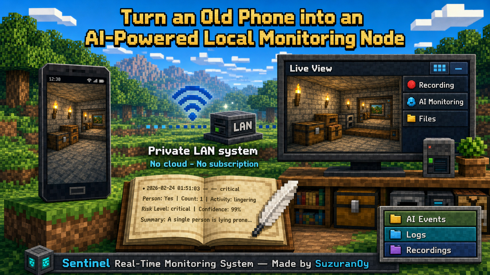

<a id="top"></a>

# Sentinel 实时监控系统

[](#stars)
[](#stars)
[](https://github.com/suzuran0y/CCTV-Smartphone-AI-Monitoring/issues/2)
[](https://www.python.org/)
[](CamFlow_UserGuide.md)
<br>
[🇺🇸 English](README.md) | [🇨🇳 中文](README_CN.md)

本项目已被 [科技爱好者周刊](#CR) 和 [科技补全](#CR) 收录。感谢他们的认可与支持。

🚀 最新更新（持续迭代中）：[v1.1.2 — 2026-06-26](https://github.com/suzuran0y/CCTV-Smartphone-AI-Monitoring/issues/2)

---

Sentinel 是一个运行于局域网环境中的分布式实时视觉系统框架。

<p align="center">
  
</p>

<p align="center">
  <em>图 1 – 系统简示 (AI-generated — 作者不会画画 ·_· )</em>
</p>

♻️ 支持将闲置安卓设备转化为网络摄像头节点，实现：

- 局域网图像采集与上传；
- PC 端实时视频展示；
- AI 监控分析。

系统采用“移动端采集 + PC 端处理 + 浏览器控制”的分层架构设计，支持实时图像预览、本地视频录制与结构化事件分析，并可扩展接入多模态 AI 模型。

- 系统前端由 PC 端 Dashboard + CamFlow 安卓客户端组成。  

本项目既可作为轻量级本地监控系统使用，亦可作为视觉数据采集与智能分析的工程原型平台。

<p align="center">
  
</p>

<p align="center">
  <em>图 2 – 系统运行展示（Dashboard + AI Monitoring）</em>
</p>

> 首次使用前强烈建议按顺序阅读章节，点击可跳转：  
> ① [项目概览](#sec1) → ② [项目部署](#sec3) → ③ [运行项目](#sec4) → ④ [Dashboard 指南](#sec43)

---

## 目录

- [1. 项目概览](#sec1)
  - [1.1. 核心能力](#sec11)
  - [1.2. 系统架构](#sec12)
  - [1.3. 现实应用](#sec13)

- [2. 实现功能](#sec2)
  - [2.1. 实时视频预览](#sec21)
  - [2.2. 系统参数自定义](#sec22)
  - [2.3. AI 触发式监控与可控认知输出](#sec23)
  - [2.4. 移动端摄像采集应用（CamFlow）](#sec24)

- [3. 项目部署](#sec3)
  - [3.1. 环境要求](#sec31)
  - [3.2. 获取项目源码](#sec32)
  - [3.3. PC 端部署](#sec33)
  - [3.4. Android 端部署](#sec34)

- [4. 运行项目](#sec4)
  - [4.1. 启动 PC 端](#sec41)
  - [4.2. 启动 CamFlow](#sec42)
  - [4.3. Dashboard 指南](#sec43)
  - [4.4. AI 监控功能](#sec44)
  - [4.5. Dashboard AI 模块指南](#sec45)
  - [4.6. 第三方模型调用](#sec46)

- [5. 版本信息与项目说明](#sec5)
  - [5.1. 系统版本信息](#sec51)
  - [5.2. 测试环境说明](#sec52)
  - [5.3. 后续规划](#sec53)
  - [5.4. 使用与授权说明](#sec54)

---

<a id="sec1"></a>

## 1. 项目概览 [⌃](#top)

Sentinel 是一个基于局域网运行的实时监控系统，亦可以作为一件数据采集、分析工具，由以下两部分组成：

- **CamFlow（Android 客户端）**：采集手机摄像头画面，并以 JPEG 单帧形式上传至服务器。
- **PC 端 Dashboard（Flask + Web UI）**：接收图像帧，提供实时预览、视频录制、截图保存、日志查看，以及可选的 AI 触发式监测功能。

系统支持本地局域网环境运行，不依赖云端服务。但为了运行多模态模型，推荐需要接入线上模型推理。

---

<a id="sec11"></a>

### 1.1. 核心能力 [⌃](#top)

Sentinel 的设计目标不是提供单一监控功能，而是构建一个可扩展的“移动端采集 + PC 端处理 + 浏览器控制”实时视觉系统框架。其核心能力包括：

<table>
<tr>
<td width="50%">

- **自研 Android 摄像客户端（CamFlow）**  
  可使用普通手机即可作为实时摄像终端，无需购买专用 IP Camera 或额外硬件设备。

- **浏览器实时 MJPEG 视频预览**  
  基于 HTTP 流式输出，无需插件即可在浏览器中实时查看画面。

- **标准化图像帧上传接口（HTTP POST）**  
  Android 客户端以 JPEG 单帧形式持续上传，接口清晰、可扩展。

- **分段式本地视频录制（MP4）与实时截图**  
  支持按时间分段写入视频、图像文件，适用于长期运行与存档管理。

  </td>
<td width="50%">

- **分层触发式视觉处理机制**  
  采用“传统 CV 算法 → 模型推理”的两阶段架构，升实时性并降低计算与推理成本。

- **结构化多模态视觉认知能力**  
  在触发条件后调用视觉模型进行语义分析，输出结构化结果，支持风险分级与事件管理。

- **UDP 自动发现服务器机制**  
  Android 客户端可自动识别局域网服务器地址，减少手动配置。

- **结构化日志与配置管理系统**  
  本地生成运行日志与 AI 事件记录，支持可追溯与数据分析。

</td>
</tr>
</table>

---

<a id="sec12"></a>

### 1.2. 系统架构 [⌃](#top)

系统由三层结构组成：

1. 数据采集层（Android App）
2. 服务处理层（PC Server）
3. 展示与控制层（Browser Dashboard）

---

```
┌────────────────────────────────────────────┐
│            Android 客户端 (CamFlow)         
│                                            
│  摄像头采集 → JPEG 单帧 → HTTP POST /upload 
└────────────────────────────────────────────┘
                      │
                      ▼
┌────────────────────────────────────────────┐
│              PC 端 Flask Server            
│                                            
│  ① FrameBuffer（最新帧缓存）              
│       ├── 提供 MJPEG 流 (/stream)          
│       ├── 提供 Snapshot                    
│       └── 提供 Recorder 读取               
│                                            
│  ② Recorder 录制模块                     
│       └── 按 FPS 写入分段视频文件           
│                                            
│  ③ AI Monitor（可开启模块）                
│       ├── Motion Trigger（传统 CV 算法检测） 
│       ├── Vision Model Interface（可插拔） 
│       └── 事件记录/实时反馈（本地/网页读取）        
│                                           
│  ④ Config & Log 管理                     
│       ├── config.json                      
│       └── server.log                       
└────────────────────────────────────────────┘
                      │
                      ▼
┌────────────────────────────────────────────┐
│            浏览器 Dashboard                
│                                            
│  实时预览 | 录制控制 | 参数配置 | 日志查看 
└────────────────────────────────────────────┘
```

---

- 架构设计

  - 所有图像数据仅在局域网内流动；
  - FrameBuffer 作为核心共享数据结构，避免重复解码；
  - 录制与 AI 分析均从 FrameBuffer 读取，互不影响；
  - AI 模块采用“接口式设计”，可灵活接入不同视觉模型；
  - Dashboard 仅作为控制与展示层，不参与图像处理。

---

<a id="sec13"></a>

### 1.3. 现实应用 [⌃](#top)

Sentinel 不仅是一个实时监控工具，更是一个可扩展的视觉数据采集与分析平台。其局域网本地化运行特性，使其在以下场景中具备实际价值：

<table>
<tr>
<td width="50%">

#### 本地隐私型监控方案

- 数据完全存储于局域网 PC 端  
- 不依赖云存储或第三方平台  
- 无需额外存储卡与订阅费用  
- 适用于家庭、实验室、工作室等私有环境  

#### AI 行为分析实验平台

- 支持多模态视觉模型接入  
- 可通过 Prompt 控制输出结构  
- 输出人数、行为、风险等级与置信度  
- 适用于行为识别与风险分析研究  

</td>

<td width="50%">

#### 数据采集与分析原型系统

- 自动生成结构化 JSON 事件记录  
- 本地视频与日志可追溯  
- 便于后续统计分析与模型优化  
- 可作为小型视觉数据采集原型  

#### 分布式视觉系统架构示例

- Android 端采集 + PC 端处理  
- 状态机驱动的触发式 AI 分析  
- FrameBuffer 解耦式设计  
- 可用于教学与系统架构演示  

</td>
</tr>
</table>

---

<a id="sec2"></a>

## 2. 实现功能 [⌃](#top)

<a id="sec21"></a>

### 2.1. 实时视频预览 [⌃](#top)


Sentinel 提供基于浏览器的实时视频预览能力。Android 设备采集的摄像头画面以 JPEG 单帧形式持续上传至服务器，服务器通过 MJPEG 流方式向浏览器推送实时画面。

该机制具备以下特点：

<table>
<tr>
<td width="55%">

- **基于 MJPEG 流实现** 浏览器无需插件即可实时解析并刷新画面。

- **无需额外客户端软件** 使用者仅需通过浏览器访问 Dashboard 地址，即可查看实时视频。

- **局域网低延迟传输** 在同一 WiFi 网络环境下，端到端延迟通常在毫秒级别。

- **解耦式架构设计** 实时预览从 FrameBuffer 读取最新帧，与录制或 AI 分析模块互不干扰。

- **支持动态参数调整** 可通过配置修改流帧率与 JPEG 压缩质量，以适配不同设备性能与网络环境。

- **完全本地化存储与数据掌控**  与依赖 SD 卡或云存储的传统监控方案不同，Sentinel 将视频数据直接保存在局域网内的 PC 端。本地落盘避免了云服务费用与第三方数据风险，同时也更便于后续进行数据分析、模型训练或二次处理。

</td>
<td width="45%" align="center">


<br>
<b>图 3 - Dashboard 实时预览界面（全屏模式）</b>

</td>
</tr>
</table>

---

<a id="sec22"></a>

### 2.2. 系统参数自定义 [⌃](#top)

Sentinel 并非固定行为的“黑盒监控工具”，而是一套高度可调的实时视觉系统。用户可通过 Dashboard 对视频流、录制策略以及 AI 行为进行精细化控制，以适配不同硬件环境与应用场景。

<table>
<tr>
<td width="55%">

系统参数主要分为三类：

#### ① 视频流参数

- Stream FPS（实时预览帧率、JPEG Quality（图像压缩质量）、Upload FPS（上传速率）......

使用者可以在画质与网络带宽之间进行平衡，适用于弱网或低性能设备环境。

---

#### ② 录制策略参数

- Record FPS（录制帧率）、Segment Seconds（分段时长）、Codec（视频编码方式）......

设定分段写入与编码视频文件，避免单文件过大，同时便于长期运行与存档管理。

---

#### ③ AI 行为参数

- OBSERVE Interval（检测间隔）、Motion Threshold（运动触发阈值）、Prompt Template / Scene Profile ......

这些参数允许设置页调整“AI 触发灵敏度”与“模型判断逻辑”，实现模型 token 量的优化与不同监控场景的个性化。

</td>
<td width="45%" align="center">


<br>
<b>图 4 - Dashboard 参数控制界面（展开信息）</b>

</td>
</tr>
</table>

---

<a id="sec23"></a>

### 2.3. AI 触发式监控与可控认知输出 [⌃](#top)

在多模态视觉模型的支持下，Sentinel 不仅能够“看到画面”，更能够对场景进行结构化理解与风险判断。系统采用“运动触发 + 模型分析”的分层机制：

- 用“传统视觉算法 + 大模型推理”进行分层处理，减少 token 消耗与 API 成本；
- 当触发条件满足时，系统调用模型进入 OBSERVE 状态；
- 调用视觉模型进行语义分析并输出结构化 JSON 结果；
- 记录观测结果并实时展示于 Dashboard。

<table>
<tr>
<td width="55%">

AI 模块具备以下能力：

#### ① 结构化语义输出

当前设定下模型分析均输出统一结构：是否存在人员（has_person）、风险等级（risk_level）、置信度（confidence）、场景摘要（summary）......

结构化输出便于后续规则引擎处理或数据统计分析。

---

#### ② 事件级状态管理

系统可记录完整的设定事件周期：
SLEEP → OBSERVE 状态机、触发/持续时间统计、AI 调用健康监测......

这使系统在能够判断事件是否发生的基础上，还能便利管理判断的标准。

---

#### ③ 模型规则灵活可变

使用者通过修改多种提示参数：Prompt Template（角色设定）、Scene Profile（长期场景上下文）、Session Focus（短期任务关注）、Extra Rules（补充规范）使模型行为可编程、可引导。

</td>
<td width="45%" align="center">


<br>
<b>图 5 - 启用 AI 状态</b>

</td>
</tr>
</table>

---

<a id="sec24"></a>

### 2.4. 移动端摄像采集应用（CamFlow） [⌃](#top)

Sentinel 并不依赖专用监控摄像头，而是配套提供自研 Android 客户端 **CamFlow**，用于完成图像采集与数据上传。

CamFlow 将普通手机转化为实时摄像终端，并：

<table>
<tr>
<td width="55%">

#### ① 实时图像采集与上传

- 调用手机原生摄像头
- 以 JPEG 单帧形式持续上传
- 支持自定义上传帧率与图像质量（代码接口）

---

#### ② 自动发现与连接

- 支持 UDP 自动发现服务器或手动输入
- 调试信息实时提示
- 指定设备特定摄像头（代码接口）

---

#### ③ 控制运行状态

- 支持启动/停止采集
- 可关闭预览以节能
- 提供运行状态反馈

---

CamFlow 与 PC 端形成“移动采集 + 本地处理”的完整系统架构，  
无需额外硬件设备即可构建实时视觉系统。

</td>

<td width="45%" align="center">


<br>
<b>图 6 - CamFlow 应用界面</b>

</td>
</tr>
</table>

> 📘 详细功能说明与使用方法请参阅 **[CamFlow 使用说明](CamFlow_UserGuide_CN.md)**。

---

### 贡献 🤝

项目仍在持续完善中，欢迎提交 Issue 或 PR！

如果你有新的想法、改进建议或发现了问题，欢迎随时参与。  
哪怕是很小的改动也很有价值，欢迎一起完善这个项目。

---

<a id="sec3"></a>

## 3. 项目部署 [⌃](#top)

请按照以下顺序完成项目的基础部署：

- 获取项目源码
- 部署 PC 端服务器
- 安装 Android 客户端 APK


### 项目结构 📂

```
Sentinel/
│
├── server.py                     # 程序入口（启动 Flask、初始化运行环境、启动各线程）
├── README.md                     # 项目说明文档
├── CamFlow_UserGuide.md          # 安卓端使用说明
├── requirements.txt              # 安装依赖
├── .gitignore                    # 忽略项
├── LICENSE                       # MIT License
│
├── app/                          # 主应用包
│   │
│   ├── __init__.py               # 包初始化
│   │
│   ├── ai/                       # AI 相关模块（可选启用）
│   │   ├── ai_ark.py             # 视觉模型接口实现（可替换）
│   │   ├── ai_monitor_worker.py  # AI 监测线程（SLEEP/OBSERVE 状态机）
│   │   ├── ai_store.py           # AI 事件写入与持久化
│   │   ├── motion_trigger.py     # 低成本运动检测模块
│   │   └── __init__.py
│   │
│   ├── config/                   # 配置管理模块
│   │   ├── config.json           # Dashboard 保存后自动生成
│   │   ├── config_store.py       # 配置校验与读写逻辑
│   │   └── __init__.py
│   │
│   ├── core/                     # 系统核心运行模块
│   │   ├── frame_buffer.py       # 最新帧缓存（系统数据共享中心）
│   │   ├── logger.py             # 日志初始化
│   │   ├── runtime.py            # 全局运行状态管理
│   │   ├── upload_stats.py       # 上传统计信息
│   │   └── __init__.py
│   │
│   ├── net/                      # 网络相关模块
│   │   ├── net_discovery.py      # UDP 自动发现服务
│   │   └── __init__.py
│   │
│   ├── recorder/                 # 视频录制模块
│   │   ├── recorder.py           # 视频写入逻辑
│   │   ├── recorder_worker.py    # 录制线程控制
│   │   └── __init__.py
│   │
│   └── web/                      # Web 界面与接口层
│       ├── webapp.py             # Flask 路由与 API
│       ├── __init__.py
│       │
│       ├── static/               # 前端静态资源
│       │   ├── dashboard.js
│       │   └── style.css
│       │
│       └── templates/            # HTML 模板
│           ├── dashboard.html
│           └── dashboard.txt
│
├── PhoneCamSender/               # Android 客户端源码（Android Studio 项目）
│   ├── app/                      # Android 应用模块
│   ├── gradle/                   # Gradle 配置
│   ├── build.gradle
│   ├── settings.gradle
│   └── ...
│   └── CamFlow-v1.0.0-beta.apk   # 已编译 APK
│
├── assets/                       # README 展示图片
│   ├── app_main_page.jpg
│   ├── app_setting_page.jpg
│   └── app_failed_hint.jpg
│
├── log/                          # 运行日志目录（首次运行为空）
│   ├── server.log                # 系统运行日志
│   └── ai_events.jsonl           # AI 事件记录
│
└── recordings/                   # 视频与截图输出目录（首次运行为空）
    ├── snapshots/
    └── videos/
```

---

<a id="sec31"></a>

### 3.1. 环境要求 [⌃](#top)

| PC 端 | Android 端 |
|---------------|-------------------|
| Python 3.9 及以上 | Android 8.0 及以上 |
| Windows / macOS / Linux | 允许安装未知来源应用 |
| 安装 Git（用于克隆仓库） | 与 PC 位于同一局域网 |

---

<a id="sec32"></a>

### 3.2. 获取项目源码 [⌃](#top)

在 cmd 终端执行：

```bash
git clone https://github.com/suzuran0y/CCTV-Smartphone-AI-Monitoring.git
cd CCTV-Smartphone-AI-Monitoring
```

---

<a id="sec33"></a>

### 3.3. PC 端部署 [⌃](#top)

#### 3.3.1. 创建虚拟环境（推荐）
> Windows 系统
```bash
python -m venv venv            # 创建环境
venv\Scripts\activate          # 激活环境
```
> macOS / Linux 系统
```bash
python3 -m venv venv
source venv/bin/activate
```

#### 3.3.2. 安装依赖

```bash
pip install -r requirements.txt
```

依赖库内容为：

```
flask>=2.2                     # Web 服务
numpy>=1.23                    # 图像数据处理
opencv-python>=4.8             # 图像解码与视频写入
volcenginesdkarkruntime        # AI 模块依赖
```

---

<a id="sec34"></a>

### 3.4. Android 端部署 [⌃](#top)

Android 端应用 CamFlow 负责了项目的摄像功能与图像上传。应用源码位于项目库路径：

```
PhoneCamSender/
```

已编译 APK 文件路径：

```
PhoneCamSender/CamFlow-v1.0.0-beta.apk
```

#### 3.4.1. 使用 APK 快速安装（推荐）

对于普通使用者，直接使用安装包比较方便：

1. 使用克隆仓库中的安装包文件或从项目 Release 页面下载 APK 文件；

2. 打开 APK 文件，将 **CamFlow** 安装到 Android 设备；

3. 若系统提示，允许安装未知来源应用，完成安装并打开应用。

#### 3.4.2. Android Studio 编译安装（可选）

对于想调试功能的开发者，可以从源码构建：

1. 使用 Android Studio；

2. 打开项目 Sentinel/PhoneCamSender；

3. 连接 Android 设备；

4. 等待 Gradle 同步完成后运行项目。

> 📘 Android 端详细功能说明与使用方法请参阅 **[CamFlow 使用说明](CamFlow_UserGuide_CN.md)**。

---

<a id="sec4"></a>

## 4. 运行项目 [⌃](#top)

> 当完成项目部署后，通过 **PC 端启动 → 手机端连接 → Dashboard 可见画面** 的全链路来确保整条链路畅通。  
---

**你应该看到的成功标志：**
- 终端输出类似 `http://127.0.0.1:<PORT>/` 与 `http://<LAN_IP>:<PORT>/`
- 浏览器能打开 Dashboard 页面
- 手机端 Test connection / Ping 成功（或状态提示连接成功）

> 注意：PC 端启动后，系统会将某些开关重置为默认安全状态（例如 ingest / recording 默认关闭）。这是正常设计，用于避免误录制或误接收数据。

---

<a id="sec41"></a>

### 4.1. 启动 PC 端（Server + Dashboard） [⌃](#top)

在项目根目录运行：

```bash
python server.py
```

启动成功后，你应该在终端看到类似输出：

```
===========================================================
PhoneCam Server Started
Local:   http://127.0.0.1:<PORT>/        for dashboard web  # 网页端推荐使用地址
LAN:     http://<LAN_IP>:<PORT>/         for CamFlow link   # 设备端 CamFlow 连接使用地址
Default ingest: OFF (enable in dashboard)
===========================================================

* Serving Flask app 'app.web.webapp'
* Debug mode: off
```

> ⚠️ 注意：摄像设备端要填写 LAN 地址。启动成功但未开启 ingest 时，Live View 为空属于正常现象。

至此，PC 端服务已成功启动。

---

<a id="sec42"></a>

### 4.2. 启动 CamFlow（Android App） [⌃](#top)

#### 4.2.1. 前置条件

- PC 与手机连接到 同一局域网（同一 Wi-Fi）；
- PC 端服务已启动，并能在浏览器打开 Dashboard。

#### 4.2.2. 连接方式

- 自动发现：CamFlow 支持在局域网内尝试发现服务器。如果发现成功，应用设置页或主页面会显示识别到的 Server Address。

- 手动填写：若自动发现失败，请手动填写 Server Address。

在 CamFlow 设置中填入先前 PC 端运行 `server.py` 时输出的 LAN 地址 IP：

```
<LAN_IP> or <LAN_IP>:<PORT>             # 从输出 http://<LAN_IP>:<PORT>/ 中摘取
```

#### 4.2.3. 启动上传（推送帧）

- 当 Server Address 连接成功后程序会自行开始采集/上传摄像数据。

- 点击 App 主界面右上角可以进入设置页进行 App 的进一步设置。

#### 4.2.4. PC 端验证

- 在 CamFlow 中确认链接成功后，在 PC 端打开浏览器输入先前 `server.py` 输出的 dashboard 地址，进入 dashboard 页面。

- 由于 `Ingest` 默认为 `off` 状态，因此初打开页面时 Live View 栏不会显示摄像端画面而是 `Ingest OFF - enable in dashboard`。

- 点击按钮 `Enable Ingest`，查看 Live View 是否出现画面。如果没画面，则展开 Live View 栏下方的 Logs 栏（默认折叠）查看是否出现 ingest disabled 等，并根据信息调试设置。

- 正常情况下，随着 `Ingest` 状态为 `ON` ，PC 端的 dashboard 中的 Live View 栏会立刻更新摄像设备的图像信息。

至此，CamFlow 服务以及与 PC 端的数据传输已成功启动。而 CamFlow 的详细使用说明请参考仓库中的文档：**[CamFlow 使用说明](CamFlow_UserGuide_CN.md)**。

---

<a id="sec43"></a>

### 4.3. Dashboard 指南 [⌃](#top)

> Dashboard 页面由 `dashboard.html + dashboard.js + style.css` 组成，核心数据来自后端 API 。
---

#### 4.3.1. 页面结构

Dashboard 的布局分为三部分：顶部栏 + 左侧监控区 + 右侧设置区

- **顶部栏**
  - 标题：`Sentinel System Dashboard` & 副标题：`Multi-Device Vision Monitoring & Risk Detection System`
  - 按钮：`Shutdown`
- **左侧面板**
  - `Live View`：实时画面预览 + 快捷控制按钮
  - `Monitor Status`：系统状态汇总 + `Logs`：系统日志
- **右侧面板**
  - `Settings`：所有可调参数输入框
  - `AI Monitoring`：AI 模块开关与配置
  - `Apply / Save / Load`：配置应用与读写

> 中间的页面分隔条设计为可拖动，用于调整两侧面板显示占比；  
> 点击 `Collapse` 按钮以折叠右侧 Settings 面板来扩大 Live View 区域，后续可以点击 `Expanding Settings` 按钮来展开已折叠区域。

---

#### 4.3.2. 画面预览区（Live View）

  
手机端上传的最新帧会进入 PC 端 FrameBuffer，然后浏览器通过 `/stream` 以 MJPEG 方式持续刷新显示在 Live View 中。

① 画面显示逻辑

Live View 的画面显示取决于 CamFlow 是否上传摄像信息以及 PC 端 Ingest（允许 `/upload` 写入 FrameBuffer）是否开启。

- **Ingest 关闭时**：显示 `Ingest OFF - enable in dashboard`；
- **Ingest 已开启但尚未收到帧**：显示 `Waiting for frames...` 。

---

② 核心按钮区

Live View 下方有三个按钮，其在初始状态下默认未开启：`Enable Ingest`、`Start Recording`、`Snapshot`。

1. **Enable / Disable Ingest**
   - 功能：控制服务器是否接收 CamFlow 上传图像信息；
   - 特性：当点击 `Disable Ingest` 时，画面立即回到占位状态，便于观察有无数据流入；
   - 用法：点击按钮切换 `Ingest` ON/OFF 状态。

2. **Start / Stop Recording**
   - 功能：控制录制线程是否将 FrameBuffer 写入分段视频；
   - 特性：录制与预览功能互不干扰，视频录制的进行只需确保 `Ingest` 开启；
   - 输出路径结构：`recordings/videos/YYYYMMDD/<cam_name>_YYYYMMDD_HHMMSS.mp4`，可于设置栏修改；
   - 用法：点击按钮切换 `Recording` ON/OFF 状态。


3. **Snapshot**
   - 功能：保存当前帧截图。
   - 输出路径结构：`recordings/snapshots/YYYYMMDD/snapshot_YYYYMMDD_HHMMSS.jpg`，可于设置栏修改； 
   - 用法：点击按钮即触发截图功能。

---

#### 4.3.3. 状态汇总区（Monitor Status）

`Monitor Status` 是集成系统运行信息的区域，随系统设置实时动态刷新。

下表对核心字段进行结构化说明：

| 字段 | 字段形式 | 意义 | 使用与异常判断 |
|------|----------|------|----------------|
| **Ingest** | 布尔值（ON / OFF） | 是否接收摄像端上传图像 | OFF 时 `/upload` 会被拒绝，若画面为空首先检查此项 |
| **Recording** | 布尔值（ON / OFF） | 是否正在录制视频文件 | ON 但未生成文件 → 检查设置栏 `Output Root`、编码器或录制线程状态 |
| **Last frame age** | 数字（秒） | 距离最后成功写入帧的时间 | 持续保持小数秒级为正常，若持续增大 → 上传中断或被拒绝 |
| **Upload FPS** | 数字（帧/秒） | 服务器估计的上传帧率 | 接近 0 → CamFlow 未上传或 Ingest 关闭 |
| **Stream FPS** | 数字（帧/秒） | 浏览器端 MJPEG 刷新频率 | 浏览器卡顿可适当降低，过高会增加 CPU 占用 |
| **JPEG Quality** | 数字（0–100） | 预览画面压缩质量 | 质量越高越清晰但占用越高，高质量+高 FPS 可能导致性能压力 |
| **Record FPS** | 数字（帧/秒） | 视频录制帧率 | 过高会增加写盘压力，过低会导致视频不流畅 |
| **Segment Seconds** | 数字（秒） | 视频分段时长 | 文件过大可降低该值，过小会生成大量文件 |
| **Recording file** | 字符串（文件路径） | 正在写入的视频路径 | 若 `Recording = ON` 但为该字段为空 → 录制线程未正常运行 |
| **Rec elapsed** | 时间字符串（HH:MM:SS） | 当前录制持续时间 | 不增长 → 录制未真正开始 |
| **Seg remaining** | 数字（秒） | 当前分段剩余时间 | 异常跳变 → 时间配置或分段逻辑出错 |
| **Upload counts** | 结构化计数字段 | 上传结果统计 | 随着 Ingest 开启而统计上传信息，本身包含多个子字段 |

---

#### Upload counts 字段拆解说明

| 子字段 | 含义 | 正常趋势 | 异常说明 |
|--------|------|----------|----------|
| **200_ok** | 成功上传并写入的次数 | 持续增长 | 若不增长说明无有效上传 |
| **400_missing_image** | 请求缺少 `image` 字段 | 应为 0 | 客户端字段名错误 |
| **400_decode_failed** | 收到数据但无法解码 | 应为 0 | 数据损坏或非 JPEG |
| **503_ingest_disabled** | Ingest 关闭时被拒绝次数 | `Ingest = OFF` 时增长 | Ingest 未开启 |

---

#### 4.3.4. 日志栏（Logs）

在 `Monitor Status` 下方有一个折叠的 Logs 区域，用于查看服务器实时运行日志。 

- 默认折叠，点击 `Logs` 该行可展开查看；
- 日志来源于读取 `log/server.log`（项目运行时生成）；
- 系统运行遇到问题时可打开 Log 栏检查运行信息。

> 注意：Logs 只展示最近 50 次记录。若想回溯更早日志，请直接打开 `log/server.log` 文件查看完整内容。

---

#### 4.3.5. 配置设置区（Settings）

右侧 Settings 面板包含系统参数输入框于配置按钮，修改系统配置时需要先调整设置参数，确认配置后应用到系统。

① 设置栏

下表对 Dashboard 中的设置配置项进行说明。  
> 建议在修改参数前理解“作用”和“推荐范围原因”，避免出现性能或稳定性问题。

| 配置名 | 字段形式 | 作用 | 推荐取值 |
|------|----------|------|--------------|
| **Stream FPS** | 数字（帧/秒） | 控制浏览器端的 MJPEG 刷新频率 | 推荐 8–15。过高会增加 CPU 与带宽占用，低于 5 画面会明显卡顿。 |
| **JPEG Quality** | 数字 | 控制画面的 JPEG 质量压缩系数 | 推荐 60–80。过低画面模糊，过高在高 FPS 下会明显增加 CPU 负担。 |
| **Record FPS** | 数字（帧/秒） | 控制录制视频的写入帧率 | 推荐 10–15。过高会增加写盘压力与文件体积，低于 8 视频流畅度下降。 |
| **Segment Secs** | 数字（秒） | 控制单个视频文件分段时长 | 推荐 60–3600。过大会生成超大文件，过小会生成大量碎片文件。 |
| **Output Root** | 字符串（文件路径） | 视频与截图输出路径 | 推荐使用默认 `recordings`，避免使用系统盘根目录或无权限路径。 |
| **Cam Name** | 字符串（标识名） | 摄像头标识，会写入文件名 | 推荐使用简洁标识（如 `phone1`），避免空格与特殊字符。 |
| **Codec** | 字符串（FourCC 编码） | 视频编码格式，可选 `avc1` / `mp4v` / `XVID` | 推荐 `avc1` 或 `XVID`（兼容性好），不同系统对编码器支持不同，若录制出错可更换。 |
| **Autosave** | 布尔值（true / false） | 是否在 `Apply` 后自动写入 `config.json` | 推荐开发阶段开启，实验调参阶段可关闭，避免频繁覆盖配置。 |

---

> 注意：修改参数时，更新不会自动生效，必须通过下方按钮进行应用。建议先停止系统当前任务，以确保参数完全生效。

② AI 监控区（AI Monitoring）

在预设配置下，AI 模块处于关闭状态，若需要开启请点击 AI Monitoring 栏右侧的 `Enable` 按钮，此时 Dashboard 右侧将显示 AI 设置与状态区域。

详细信息请查看 [4.4. AI 监控功能](#sec44)。

③ 应用按钮

- Apply / Save / Load 的区别

  - **Apply**
    - 将当前输入框参数提交到后端 `/api/config` 并立即更新运行配置。
    - 若参数非法（超出范围/类型不对），后端会拒绝并返回错误提示。
  - **Save**
      - 将当前配置写入本地文件保存（`app/config/config.json`）。
  - **Load**
      - 从磁盘加载 `config.json`，并刷新页面表单。

> - 初次加载系统时会使用一套预填写好的配置参数；
> - 若需要自定义系统配置，请在页面设置区修改参数后，点击 `Apply` 按钮，此时系统将执行新配置方案并覆盖旧方案；
> - （在 `Autosave` 未开启时）点击 `Save` 按钮，则新配置方案将保存到本地；
> - 后续点击 `Load` 按钮时，可将本地方案覆盖至页面设置区而无需再次填写。

---

#### 4.3.6. Shutdown（停止系统）

> ⚠️ 这是“结束服务”的按钮，顶部 `Shutdown` 按钮会触发系统关闭流程：停止录制、关闭 ingest、停止 Python 服务，并尝试关闭页面。

---

<a id="sec44"></a>

### 4.4. AI 监控功能（可选功能） [⌃](#top)

> AI 模块为 **可选功能增强模块**：即使不配置任何 API Key，系统仍可完整运行 **视频上传 / 实时预览 / 录制 / 截图 / 日志** 等基础功能。 

Sentinel 的 AI 模块采用事件驱动的 **分层触发式视觉认知架构**。系统并非逐帧推理，而是通过轻量运动检测、双状态机控制与结构化事件管理，实现 **更低成本** 的长期智能监控。模块化设计支持模型可插拔、输出合同约束与系统解耦，使其具备良好的可扩展性、可解释性与可维护性。

- #### AI 模块主流程框架（从 Frame 到 Dashboard）

```
┌──────────────────────────────────────────────────────────────┐
│                          数据输入层                                                                                    
│  CamFlow → POST /upload → FrameBuffer (Latest Frame Cache)  
└──────────────────────────────┬───────────────────────────────┘
                               │
                               ▼
┌──────────────────────────────────────────────────────────────┐
│                       轻量级运动触发层(降低成本)                                                                             
│  - 计算帧间差异比例
│  - 如果 motion_ratio > threshold                            
│  - 则触发频率受 Motion Min Interval 控制                     
└──────────────────────────────┬───────────────────────────────┘
                               │
                               ▼ 若触发，STATE：SLEEP → OBSERVE
┌──────────────────────────────────────────────────────────────┐
│                        AI 状态机控制层                                                               
│    STATE ∈ { SLEEP, OBSERVE }                                                                             
│  SLEEP:                                                      
│    - 仅运行 motion trigger                                   
│    - 不调用模型                                                                               
│  OBSERVE:                                                    
│    - 每隔 AI Interval 调用模型                               
│    - 管理 dwell 计时                                        
│    - 计算 event_duration                                     
└──────────────────────────────┬───────────────────────────────┘
                               │
                               ▼
┌──────────────────────────────────────────────────────────────┐
│                        视觉模型接口层                                                                     
│  - 构造 Prompt（Role + Scene + Session + Extra）            
│  - 压缩 JPEG（AI JPEG Quality）                              
│  - 调用第三方视觉模型 API                                    
│  - 接收 JSON 输出                                            
│  - 执行字段合同校验（Output Contract）                       
└──────────────────────────────┬───────────────────────────────┘
                               │
                               ▼
┌──────────────────────────────────────────────────────────────┐
│                       事件生命周期管理层                                                           
│  - dwell ≥ threshold → confirmed                             
│  - 无目标 ≥ End Grace → 结束事件                             
│  - 写入 ai_events.jsonl                                      
│  - 更新 AI Runtime 状态                                      
└──────────────────────────────┬───────────────────────────────┘
                               │
                               ▼
┌──────────────────────────────────────────────────────────────┐
│                         可视化与展示层                                                  
│  - /api/ai_status                                            
│  - 展示当前 AI Result
│  - 展示 Info: Times、Metrics                                              
│  - 展示 History List                                         
└──────────────────────────────────────────────────────────────┘
```

---

<a id="sec45"></a>

### 4.5. Dashboard AI 模块指南 [⌃](#top)

> Dashboard 页面在初次打开时默认未启用 AI 模块，因此 Settings 栏下方的 AI Monitoring 区域处于隐藏状态。  
> 点击右侧的 `Enable` 按钮，启用 AI 模块。

Dashboard 页面的 AI 模块由配置设置区与信息输出区构成：

- AI Setting（设置区）：决定是否启用 AI、调用频率、阈值等；
- AI Status（状态区）：展示状态机、健康状态、AI 监控历史等。

---

#### 4.5.1. 设置区字段（AI Settings）
 
建议在启用 AI 模块前阅读各参数用途，控制调用模型的灵敏度，以便在面对不同场景进行合理调优。

| 配置名 | 字段形式 | 作用 | 推荐取值 |
|--------|----------|------|----------|
| **Provider** | 下拉选项 | 选择当前视觉模型平台 | 可选 Ark、OpenAI、Gemini、DashScope、SiliconFlow 或 OpenAI-compatible / Local。 |
| **Model ID** | 字符串（模型 ID） | 指定通用视觉模型 ID | 使用支持视觉分析的模型 ID；Ark 可留空并回退到 Legacy Ark Model。 |
| **Provider Hint** | 自动提示 | 根据 Provider 显示默认 Base URL、Key 来源和模型填写建议 | 切换 Provider 后自动更新，用于减少配置错误。 |
| **Base URL** | 字符串（接口地址） | 自定义第三方 / 本地模型服务地址 | 内置 Provider 可留空；`openai_compatible` 通常需要填写。 |
| **Provider API Key** | 字符串（密钥） | 通用模型服务访问凭证 | 需要到模型提供方获取并填入，请查看 [4.6. 第三方模型调用](#sec46)。 |
| **Timeout (sec)** | 数字（秒） | 单次模型请求超时时间 | 允许 5–120 秒，默认 30 秒。 |
| **Legacy Ark Model** | 字符串（模型 ID） | 兼容旧版 Ark / 火山方舟模型字段 | 默认可继续使用 `doubao-seed-2-0-mini-260215`。 |
| **Legacy Ark API Key** | 字符串（密钥） | 兼容旧版 Ark / 火山方舟 API Key | 仅在通用 Provider API Key 为空时作为 Ark 回退使用。 |
| **OBSERVE Interval (sec)** | 数字（秒） | 控制 OBSERVE 状态下模型调用的最小间隔 | 推荐 2–3 秒，过小会增加 token 消耗。 |
| **Dwell Threshold (sec)** | 数字（秒） | 目标持续存在多久才确认事件 | 推荐 3–5 秒，适当调大可减少偶发误报。 |
| **End Grace (sec)** | 数字（秒） | 目标消失后延迟多久结束事件 | 推荐 2–3 秒，避免短暂遮挡导致事件中断。 |
| **AI JPEG Quality** | 数字（50–95） | 发送给模型的 JPEG 质量压缩系数 | 推荐 75–90，过高会增加带宽与编码开销。 |
| **Motion Threshold (ratio)** | 小数（比例） | 判定运动发生的画面变化比例阈值 | 推荐 0.1–0.3，数值越小越敏感，AI 频繁触发可调大。 |
| **Motion Min Interval (sec)** | 数字（秒） | 两次运动触发之间的最小时间间隔 | 推荐 1–3 秒，防止高频触发。 |
| **Prompt Template (Role)** | 长文本（角色设定） | 设定模型的角色与输出格式规范 | 建议明确要求“仅输出 JSON”。 |
| **Scene Profile (Long-term)** | 长文本（长期信息） | 提供固定环境背景描述 | 描述摄像头位置、场景类型等。 |
| **Session Focus (Short-term)** | 长文本（短期目标） | 临时监控目标说明 | 例如“重点关注是否有陌生人进入”。 |
| **Extra Prompt / Rules** | 长文本（额外规则） | 补充输出语言、格式、风险判断标准 | 可指定输出语言或限制字段。 |

> 注意，参数通常需要结合实际场景光照、镜头视角与目标类型进行调优。修改参数后，建议观察 1–2 个完整事件周期再评估效果。

---

① 文本型参数详细说明（建议阅读）

> 以下四项属于“Prompt 工程”相关参数，它们会直接影响模型的输出结构与语义理解能力。

- Prompt Template (Role)：定义模型角色与输出结构。

写法举例：

```
你是一名视频监控助手。你将接收到一张监控画面以及一些背景信息。仅输出一个 JSON 对象，其中需包含是否有人出现、人数、活动情况、风险等级以及简短总结。
```

- Scene Profile (Long-term)：提供摄像头长期固定背景，帮助模型理解“何为异常”。

写法举例：

```
家中：摄像头面向的是家中客厅。
办公场景：摄像头面向办公区域。正常时间段内有多人活动属于正常情况。
```

- Session Focus (Short-term)：进行临时任务设置，可随短期需求变更。

写法举例：

```
当前关注是否有小孩靠近阳台区域。
```

- Extra Prompt / Rules：补充输出规范与语言风格。

写法举例：

```
总结请使用中文。
若无法判断，请保持 has_person=false。
```

② 字段合同（Output Contract）与自动结构约束机制

为了保证 Dashboard 能稳定解析模型输出，系统在后端实现了一个**字段合同（Output Contract）机制**。

> 无论在 Prompt Template 中如何描述任务，模型的最终输出都必须符合系统预定义的 JSON 结构。

---

#### 4.5.2. 状态区字段（AI Status）

该区域对后端 AI 状态机的运行状态进行实时可视化。

① 状态头部

位于 AI Status 顶部，显示当前状态机运行状态：

```
┌────────────────────────┬──────────────────┬─────────────────┬──────────────────────┐
| STATE: SLEEP / OBSERVE | Event: evt_xxxxx | Dwell: Yes / No | Health: Fine / Error |
└────────────────────────┴──────────────────┴─────────────────┴──────────────────────┘
```

| 字段	| 形式 | 含义 |
|--------|----------|------|
| STATE	| SLEEP / OBSERVE	| 表示当前 AI 是否处于激活状态 |
| Event	| 字符串（evt_xxxxx）	| 指明当前活跃事件 ID |
| Dwell	| Yes / No	| 判断 dwell 机制是否已达到确认阈值 |
| Health	| Fine / Error	| 表示最近一次模型调用是否成功 |

- Model Info 会同步展示当前 Provider、客户端类型、模型 ID、Base URL、API Key 是否已配置、请求超时时间，并以 `Ready` / `Needs ...` 提示当前模型配置是否完整。

- 状态机

🔹 SLEEP：仅运行传统视觉算法，不调用视觉模型，低资源消耗；

🔹 OBSERVE：定期调用视觉模型，分析结构化字段，进行事件记录。

② 最近一次模型输出（Last AI Result）

> 为了稳定模型输出结构，系统使用字段合同机制，要求在模型输入阶段需要加入固定字段结构，要求模型输出一个 JSON 对象，并至少包含以下字段：

```
{
  "has_person": bool, # Yes / No
  "person_count": int,
  "activity": str,
  "risk_level": "info|warn|critical",
  "confidence": float,
  "summary": str
}
```

对模型输出进行结构化提取后在 dashboard 进行可读化处理：（示例）

```
Person: No | Count: 0 | Activity: unknown | Risk: info | Conf: 99%
Summary: This indoor CCTV scene contains no people...
```

| 字段	| 对应 JSON	| 形式	| 说明 |
|--------|----------|------|------|
| Person |	has_person |	布尔值（Yes / No） |	是否检测到人 |
| Count	| person_count	| 数字	| 人数 |
| Activity |	activity |	字符串 |	行为描述 |
| Risk	| risk_level	| info / warn / critical	| 风险等级（低/中/高） |
| Conf	| confidence	| 0–100% 百分比	| 模型置信度 |
| Summary	| summary	| 字符串	| 自然语言总结 |

系统存在字段合同保障设计，若模型返回内容不完整，会对返回信息进行处理，确保 Dashboard 始终可以获得输出。

③ 时间信息（Times）

计算事件监测模块的运行时间：（示例）

```
Last trigger: 2026-02-24 01:48:37 (2m ago)
Last AI call: 2026-02-24 01:51:05 (6s ago)
Event start:  2026-02-24 01:48:37 (2m ago)
```

| 字段	| 含义 |
|--------|----------|
| Last trigger	| 最近一次 motion trigger 触发时间 |
| Last AI call	| 最近一次模型调用时间 |
| Event start	| 当前事件开始时间 |

④ 事件统计指标（Metrics）：（示例）

```
Person present (acc): 115.0 s
Event duration: 153.9 s
```

| 指标	| 含义 |
|--------|----------|
| Person present （acc）| 事件中“有人存在”的累计时间 |
| Event duration	| 当前事件已持续总时间 |

注：dwell_confirmed 后，即确定观测到画面里有人驻留时，才会开始累计有效人员存在时间。

⑤ 原始模型输出信息（Raw JSON）

在 Metrics 下方有一个折叠的 Raw JSON 区域，用于查看模型最新输出事件结果的原始 JSON。 

- 默认折叠，点击 `Raw JSON` 该行可展开查看。

可用于调试 Prompt 并检查字段完整性。

⑥ 历史事件记录（History List）

首次运行系统时该项为空，当一个事件结束后，会写入 `log/ai_events.jsonl`，并在页面中以时间顺序依次排列展示：（示例）

```
┌────────────────────────────────────────────────────────────┐
│ 2026-02-24 01:51:03   AI   🔴 critical                    
│ Person: Yes | Count: 1 | Activity: lingering              
│ Risk Level: critical | Confidence: 99%                    
│ Summary: A single person is lying prone...                
└────────────────────────────────────────────────────────────┘
┌────────────────────────────────────────────────────────────┐
│ 2026-02-24 01:50:48   AI   🟢 info                        
│ Person: Yes | Count: 1 | Activity: passing                
│ Risk Level: info | Confidence: 98%                        
│ Summary: One person is walking through the indoor space…  
└────────────────────────────────────────────────────────────┘
                            ...
                            ...
                            ...
```

> 注意：History List 栏只展示最近 20 次记录。若想回溯更早记录，请直接打开 `log/ai_events.jsonl` 文件查看完整内容。

---

<a id="sec46"></a>

### 4.6. 第三方模型调用 [⌃](#top)

Sentinel 的 AI 模块为可切换的视觉模型 Provider 架构。可以通过配置切换到 OpenAI、Gemini、DashScope、SiliconFlow，或其他提供 OpenAI-compatible 接口的第三方 / 本地视觉模型服务。

> 模型切换可以通过 Dashboard 前端配置区、`app/config/config.json`、环境变量或代码默认配置完成。Dashboard 已支持编辑 Provider / Model / Base URL / API Key / Timeout，并显示当前生效模型信息。

---

#### 4.6.1. 模块结构

本次模型替换能力由以下文件协同实现：

| 文件 | 作用 |
|------|------|
| `app/ai/vision_client.py` | 统一视觉模型客户端入口，负责 Provider 解析、客户端创建与 OpenAI-compatible 请求 |
| `app/ai/ai_ark.py` | 原 Ark 视觉模型客户端，继续保留 |
| `app/ai/ai_monitor_worker.py` | AI 监控线程，通过 `create_vision_client()` 创建当前模型客户端 |
| `app/config/config_store.py` | 新增通用模型配置字段与校验逻辑 |
| `app/web/webapp.py` | `/api/ai/status` 返回脱敏后的 `model_info` |
| `app/web/templates/dashboard.html` | AI Settings 新增 Provider 配置字段，AI Status 区域新增 Model Info 显示块 |
| `app/web/static/dashboard.js` | 前端加载、提交 Provider 配置，并渲染当前模型信息与配置完整性状态 |

AI 模型调用链路如下：

```text
配置来源（Dashboard / config.json / env）→ ConfigStore → resolve_provider_settings() → create_vision_client()
                                                          ├─ ArkVisionClient
                                                          └─ OpenAICompatibleVisionClient
视觉帧 FrameBuffer → analyze_frame(frame) → JSON result → AI EventStore / Dashboard
```

AI worker 只依赖统一的 `analyze_frame()` 方法，因此后续继续增加新平台时，不需要大幅修改状态机逻辑。

---

#### 4.6.2. 当前支持的 Provider

当前内置 Provider 包括：

| Provider | 类型 | 默认 Base URL | 说明 |
|----------|------|---------------|------|
| `ark` | Ark 原生客户端 | `https://ark.cn-beijing.volces.com/api/v3` | 保留原有火山方舟调用方式 |
| `openai` | OpenAI-compatible | `https://api.openai.com/v1` | 用于 OpenAI Chat Completions 视觉模型 |
| `gemini` | OpenAI-compatible | `https://generativelanguage.googleapis.com/v1beta/openai` | 用于 Gemini OpenAI 兼容接口 |
| `dashscope` | OpenAI-compatible | `https://dashscope.aliyuncs.com/compatible-mode/v1` | 用于阿里云百炼 / 通义千问兼容接口 |
| `siliconflow` | OpenAI-compatible | `https://api.siliconflow.cn/v1` | 用于 SiliconFlow 兼容接口 |
| `openai_compatible` | OpenAI-compatible | 无默认值 | 用于自定义兼容接口或本地模型网关 |

> 注意：不同平台是否支持图像输入，取决于所选模型本身。请确保 `ai_model` 指向的是具备视觉理解能力的模型。

---

#### 4.6.3. 配置字段说明

本次新增以下通用字段：

| 字段名 | 类型 | 默认值 | 说明 |
|--------|------|--------|------|
| `ai_provider` | 字符串 | `ark` | 当前使用的模型平台 |
| `ai_model` | 字符串 | 空 | 通用模型 ID。若 Provider 为 Ark 且该字段为空，会回退使用 `ark_model` |
| `ai_base_url` | 字符串 | 空 | 自定义模型服务地址。部分内置 Provider 有默认 Base URL |
| `ai_api_key` | 字符串 | 空 | 通用模型 API Key。若为空，会尝试读取环境变量 |
| `ai_request_timeout_sec` | 整数 | `30` | 模型请求超时时间，允许范围为 5 到 120 秒 |

为兼容旧版本配置，以下 Ark 字段仍然可用：

| 字段名 | 说明 |
|--------|------|
| `ark_model` | Ark / 火山方舟模型 ID |
| `ark_api_key` | Ark / 火山方舟 API Key |

当 `ai_provider = "ark"` 时，模型选择优先级为：

```text
AI_MODEL 环境变量
  > ai_model
  > ark_model
```

API Key 选择优先级为：

```text
AI_API_KEY 环境变量
  > ai_api_key
  > ARK_API_KEY 环境变量
  > ark_api_key
```

---

#### 4.6.4. 环境变量说明

系统支持通过环境变量临时覆盖配置文件，适合本地测试或部署环境使用。

通用环境变量：

| 环境变量 | 说明 |
|----------|------|
| `AI_PROVIDER` | 覆盖 `ai_provider` |
| `AI_MODEL` | 覆盖 `ai_model` |
| `AI_BASE_URL` | 覆盖 `ai_base_url` |
| `AI_API_KEY` | 覆盖 `ai_api_key` |

Provider 专用环境变量：

| Provider | 支持的环境变量 |
|----------|----------------|
| `ark` | `ARK_API_KEY` |
| `openai` | `OPENAI_API_KEY` |
| `gemini` | `GEMINI_API_KEY` / `GOOGLE_API_KEY` |
| `dashscope` | `DASHSCOPE_API_KEY` / `QWEN_API_KEY` |
| `siliconflow` | `SILICONFLOW_API_KEY` |

---

#### 4.6.5. 使用默认 Ark / 火山方舟模型

如果希望继续使用原有火山方舟模型，可保持默认 Provider：

```json
{
  "ai_provider": "ark",
  "ark_model": "doubao-seed-2-0-mini-260215",
  "ark_api_key": "YOUR_ARK_API_KEY"
}
```

也可以使用环境变量：

```powershell
$env:AI_PROVIDER = "ark"
$env:ARK_API_KEY = "YOUR_ARK_API_KEY"
```

适用场景：

- 希望继续使用原有火山方舟模型；
- 不希望改动原有 Dashboard 使用习惯；
- 需要保持旧配置兼容。

---

#### 4.6.6. 使用 OpenAI 视觉模型

配置示例：

```json
{
  "ai_provider": "openai",
  "ai_model": "gpt-4o-mini",
  "ai_api_key": "YOUR_OPENAI_API_KEY"
}
```

环境变量示例：

```powershell
$env:AI_PROVIDER = "openai"
$env:AI_MODEL = "gpt-4o-mini"
$env:OPENAI_API_KEY = "YOUR_OPENAI_API_KEY"
```

系统会自动使用：

```text
https://api.openai.com/v1/chat/completions
```

---

#### 4.6.7. 使用 Gemini OpenAI-compatible 接口

配置示例：

```json
{
  "ai_provider": "gemini",
  "ai_model": "gemini-2.5-flash",
  "ai_api_key": "YOUR_GEMINI_API_KEY"
}
```

环境变量示例：

```powershell
$env:AI_PROVIDER = "gemini"
$env:AI_MODEL = "gemini-2.5-flash"
$env:GEMINI_API_KEY = "YOUR_GEMINI_API_KEY"
```

系统会自动使用：

```text
https://generativelanguage.googleapis.com/v1beta/openai/chat/completions
```

---

#### 4.6.8. 使用 DashScope / 通义千问兼容接口

配置示例：

```json
{
  "ai_provider": "dashscope",
  "ai_model": "qwen-vl-plus",
  "ai_api_key": "YOUR_DASHSCOPE_API_KEY"
}
```

环境变量示例：

```powershell
$env:AI_PROVIDER = "dashscope"
$env:AI_MODEL = "qwen-vl-plus"
$env:DASHSCOPE_API_KEY = "YOUR_DASHSCOPE_API_KEY"
```

系统会自动使用：

```text
https://dashscope.aliyuncs.com/compatible-mode/v1/chat/completions
```

---

#### 4.6.9. 使用自定义 OpenAI-compatible 服务

若使用第三方中转服务、本地模型网关或自建兼容服务，可使用：

```json
{
  "ai_provider": "openai_compatible",
  "ai_model": "your-vision-model",
  "ai_base_url": "http://127.0.0.1:9000/v1",
  "ai_api_key": "YOUR_API_KEY"
}
```

系统最终请求地址会自动拼接为：

```text
http://127.0.0.1:9000/v1/chat/completions
```

如果 `ai_base_url` 已经写到完整接口：

```json
{
  "ai_base_url": "http://127.0.0.1:9000/v1/chat/completions"
}
```

系统会直接使用该地址，不会重复拼接。

---

#### 4.6.10. Dashboard 当前模型信息

Dashboard 的 AI Status 区域新增了 `Model Info` 显示块，用于展示当前后端实际生效的模型配置。

显示内容示例：

```text
Status:   Ready
Provider: openai
Client:   openai_compatible
Model:    gpt-4o-mini
Base URL: https://api.openai.com/v1
API Key:  configured
Timeout:  30s
```

字段说明：

| 显示项 | 说明 |
|--------|------|
| `Status` | 当前模型配置完整性状态，常见为 `Ready` 或 `Needs model / API key / base URL` |
| `Provider` | 当前选择的模型平台 |
| `Client` | 后端实际使用的客户端类型 |
| `Model` | 当前模型 ID |
| `Base URL` | 当前请求的基础地址 |
| `API Key` | 只显示是否已配置，不显示真实 Key |
| `Timeout` | 请求超时时间 |

若 API Key 缺失，Dashboard 会显示：

```text
Status: Needs API key
API Key: missing
```

此时 AI 模型调用不会正常进行，但基础的视频上传、预览、录制等功能不受影响。

---

#### 4.6.11. 模型输出格式要求

无论使用哪一个模型平台，模型返回内容都必须能解析为一个 JSON 对象。

当前系统要求模型输出以下字段：

```json
{
  "has_person": true,
  "person_count": 1,
  "activity": "standing",
  "risk_level": "info",
  "summary": "A person is standing in the monitored area.",
  "confidence": 0.87
}
```

字段说明：

| 字段名 | 类型 | 说明 |
|--------|------|------|
| `has_person` | boolean | 画面中是否有人 |
| `person_count` | number 或 null | 人数 |
| `activity` | string | 活动状态，如 `passing` / `standing` / `lingering` / `unknown` |
| `risk_level` | string | 风险等级，建议为 `info` / `warn` / `critical` |
| `summary` | string | 简短描述 |
| `confidence` | number | 置信度，范围 0 到 1 |

如果模型返回结果中缺少部分字段，系统会尝试补默认值；但为了获得稳定结果，建议在 Prompt 中明确要求模型：

```text
Only output one JSON object. Do not output markdown or extra explanations.
```

---

#### 4.6.12. 验证与测试

本模块已添加自动化测试，主要覆盖：

- Provider 配置解析；
- Ark 旧字段兼容；
- Base URL 到 `/chat/completions` 的拼接逻辑；
- OpenAI-compatible 响应解析；
- API Key 脱敏模型信息输出；
- Dashboard 是否包含 Provider 配置字段与 Model Info 容器；
- `/api/config` 是否可更新通用 Provider 字段并在 `/api/ai/status` 中生效；
- 使用本地假 OpenAI-compatible 服务完整验证请求链路。

运行测试：

```powershell
python -m pytest -q
```

当前验证结果：

```text
12 passed
```

其中，本地假模型服务测试会验证：

- 请求地址是否为 `/v1/chat/completions`；
- 是否携带 `Authorization: Bearer ...`；
- 请求体中的 `model` 是否正确；
- 图像是否以 `data:image/jpeg;base64,...` 形式传递；
- 模型 JSON 输出是否能被系统解析并归一化。

---
<a id="sec5"></a>

## 5. 版本信息与项目说明 [⌃](#top)

<a id="sec51"></a>

### 5.1. 系统版本信息 [⌃](#top)

Sentinel 系统由 **PC 端服务程序 + Web Dashboard + Android 端 CamFlow** 组成，当前版本信息如下：

- **Sentinel（PC + Dashboard）版本**：v1.1.2
- **CamFlow（Android）版本**：v1.1.0
- **本文档版本**：v1.1.2
- **最后更新日期**：2026-06-26

---

<a id="sec52"></a>

### 5.2. 测试环境说明 [⌃](#top)

本系统在以下环境中完成测试与验证：

- PC 端（Server + Dashboard）
  - **操作系统**：Windows 10 / Windows 11
  - **Python 版本**：Python 3.9+
  - **主要依赖**：Flask、OpenCV、NumPy、volcenginesdkarkruntime
  - **网络环境**：同一局域网（LAN / 同一 Wi-Fi）

- Android 端（CamFlow）
  - **系统版本**：Android 8.0+
  - **测试设备**：nova 8 SE 活力版（HarmonyOS 3.0.0）
  - **网络环境**：与 PC 同一 Wi-Fi / 同一局域网
  - **权限要求**：Camera（首次启动会请求）

---

<a id="sec53"></a>

### 5.3. 后续规划 [⌃](#top)

后续可考虑的优化方向包括：

- **安全机制**
  - 增加 Token / API Key 认证（如需在公网下部署系统）
- **传输性能**
  - 用 WebSocket / WebRTC 替代部分 HTTP 轮询或 MJPEG（降低延迟与资源占用）
  - 自适应帧率 / 分辨率控制（根据网络与 CPU 动态调参）
- **AI 调用**
  - 可插拔模型接口扩展（OpenAI / 本地视觉模型 / 其他平台）
  - 更精细的事件聚合与规则引擎（减少误报/漏报）

---

<a id="sec54"></a>

### 5.4 使用与授权说明 [⌃](#top)

Sentinel 项目基于 MIT License 开源发布。

© 2026 Suzuran0y

- 本项目用于 **学习、研究与技术验证** 目的，属于原型系统（prototype）。
- 若将当前版本的系统用于真实生产环境或商业场景，请自行完善：
  - 访问鉴权
  - 传输加密
  - 日志脱敏与隐私合规策略
  - 稳定性与资源限额机制

> 备注：CamFlow 作为摄像采集端，涉及图像数据采集与传输。请在使用前确保符合当地法律法规与场景授权要求。

---

<a id="CR"></a>

**社区认可 ⭐**

<p align="center">

<table align="center">
<tr>

<td align="center" width="50%">

<a href="https://github.com/ruanyf/weekly">
  
</a>

<br>

<b>ruanyf</b><br>
<sub><a href="https://github.com/ruanyf/weekly/blob/master/docs/issue-388.md">科技爱好者周刊 #388</a></sub>

</td>

<td align="center" width="50%">

<a href="https://space.bilibili.com/67079745">
  
</a>

<br>

<b>玄离199</b><br>
<sub><a href="https://www.bilibili.com/video/BV1srwxzMEdn/">科技补全 #93</a></sub>

</td>

</tr>
</table>

</p>

---

<a id='stars'></a>

### Star History [⌃](#top)

[](https://star-history.com/#suzuran0y/CCTV-Smartphone-AI-Monitoring&Date)
